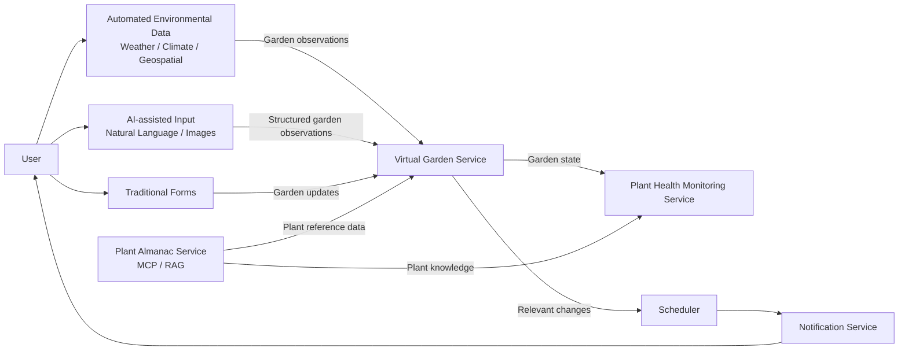
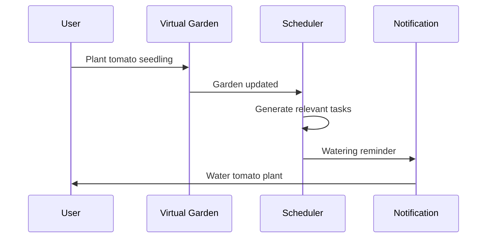
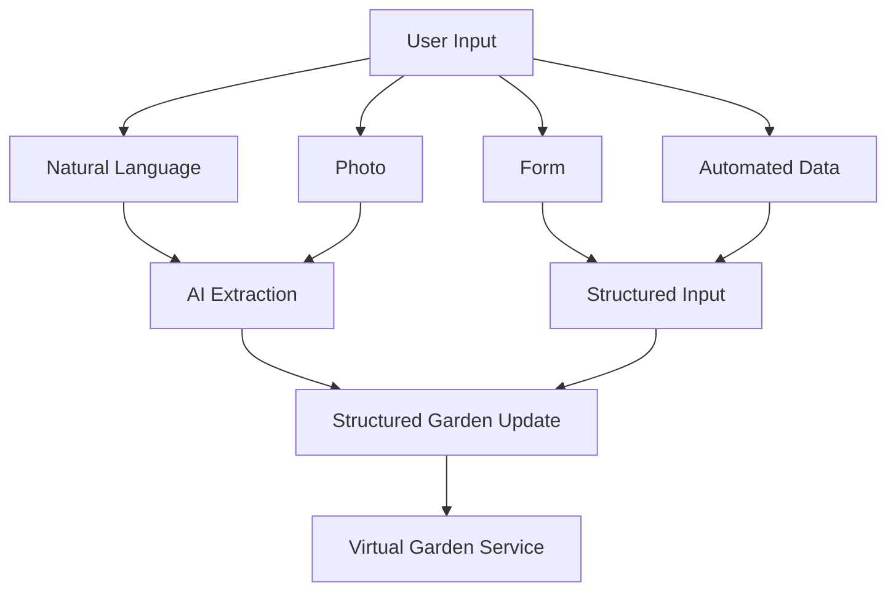
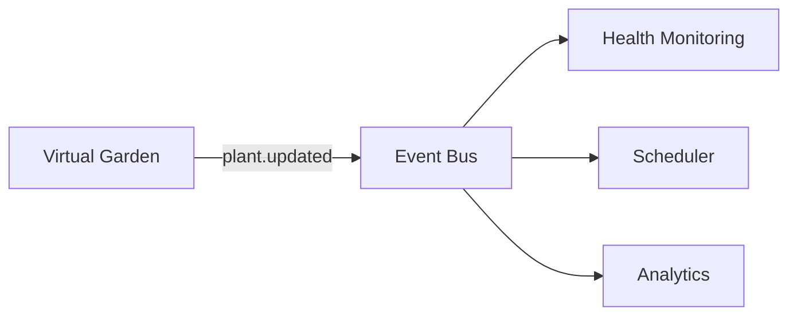

# Plant Management System

A smart plant management platform designed for **small home gardens**.

The system maintains a digital representation of a user's garden and combines information from manual input, environmental data, AI-assisted observations, and plant knowledge services to help users understand and manage their plants.

The project is built around a **microservice architecture**, with the **Virtual Garden Service** acting as the source of truth for the current state of a garden.

## Overview

Users can describe and update their garden through several input methods:

* **Natural language**

  * "I planted two tomato seedlings today."
  * "The basil leaves are starting to turn yellow."
* **Photos**

  * Images of plants, leaves, pests, soil, etc.
* **Traditional forms**

  * Planting dates
  * Watering
  * Fertilising
  * Pruning
  * Harvesting
* **Automatically collected data**

  * Weather
  * Climate
  * Geospatial information
  * Other environmental data

AI can be used to convert less structured inputs such as text and images into structured garden observations.

These observations ultimately update the user's **Virtual Garden**.

---

## Architecture



---

## Core Services

### Virtual Garden Service

The **Virtual Garden Service** maintains the current representation of a user's physical garden.

Examples of information it may store include:

* Gardens
* Garden beds
* Plants
* Plant locations
* Species/variety references
* Planting dates
* Growth stages
* Watering events
* Fertilisation events
* Pruning events
* Harvest events
* User observations
* Environmental observations
* Plant state/history

The service should be concerned with **representation, not interpretation**.

For example:

> "The tomato plant has three yellow leaves."

is valid garden state.

Determining:

> "The tomato plant probably has a nitrogen deficiency."

belongs to the **Plant Health Monitoring Service**.

### Virtual Garden Design Principles

The Virtual Garden Service should:

* Maintain the authoritative representation of the garden.
* Accept structured updates from different input methods.
* Keep historical garden events where appropriate.
* Validate references against other services when required.
* Expose garden state to other services.
* Publish relevant changes for downstream systems.

It should **not**:

* Diagnose plant diseases.
* Determine whether a plant is healthy.
* Generate gardening advice.
* Perform complex plant knowledge retrieval.
* Duplicate information owned by another service.
* Maintain a global database containing every piece of system data.

When information belongs to another domain, the Virtual Garden Service should query the service responsible for it.

---

## Plant Almanac Service

The **Plant Almanac Service** provides general knowledge about plants.

Examples include:

* Plant species
* Cultivars
* Expected growth characteristics
* Preferred soil
* Sunlight requirements
* Water requirements
* Temperature tolerances
* Seasonal information
* Companion planting information
* Common diseases
* Common pests
* Gardening recommendations

The service may use:

* Structured plant databases
* Retrieval-Augmented Generation (**RAG**)
* Large language models
* External horticultural datasets

Other services should query the Almanac rather than maintaining their own copies of this information.

The service should also be queryable through **MCP**, allowing AI assistants to access plant knowledge directly.

---

## Plant Health Monitoring Service

The **Plant Health Monitoring Service** analyses the current state of the garden.

It combines:

1. The user's actual garden state from the **Virtual Garden Service**
2. Expected plant characteristics from the **Plant Almanac Service**

For example:

```text
Virtual Garden

Tomato Plant
- planted 6 weeks ago
- leaves becoming yellow
- watered every day
- soil currently very wet

        +

Plant Almanac

Tomato
- prefers well-draining soil
- excessive watering may cause root problems

        ↓

Plant Health Monitoring

Potential overwatering detected.
```

The health service can perform tasks such as:

* Detecting abnormal plant conditions
* Identifying possible diseases
* Detecting pest symptoms
* Recognising watering problems
* Comparing growth against expected growth stages
* Identifying environmental stress
* Producing health scores
* Generating recommendations

This separation keeps health interpretation outside of the Virtual Garden domain.

---

## Scheduler

Garden changes can create or modify future tasks.

For example, adding:

```text
Planted tomato seedlings today.
```

may generate:

```text
Water seedlings
Check seedling establishment
Fertilise
Inspect growth
Expected harvest period
```

If the Virtual Garden changes, relevant scheduled tasks can be recalculated.



---

## Notifications

The notification system delivers time-sensitive garden information to users.

Possible notifications include:

* Watering reminders
* Fertilising reminders
* Pruning reminders
* Plant health warnings
* Pest alerts
* Frost warnings
* Heat warnings
* Harvest reminders
* Seasonal gardening tasks

Notifications should generally be produced from events generated by other services rather than implementing gardening logic themselves.

---

## Data Input Pipeline

Different forms of user input should ultimately result in a common structured representation.



For example:

```text
User:
"I planted three basil plants in the herb bed yesterday."
```

could become:

```json
{
  "action": "plant",
  "plant": {
    "species": "basil",
    "quantity": 3
  },
  "location": "herb-bed",
  "planted_at": "2026-08-20"
}
```

The Virtual Garden Service then validates and records the update.

---

## Event-Driven Communication

Where appropriate, changes to the Virtual Garden should produce domain events.

For example:

```text
plant.created
plant.updated
plant.removed

watering.recorded
fertilising.recorded
observation.created

garden.updated
```

Other services can subscribe to these events without tightly coupling themselves to the Virtual Garden implementation.



For operations requiring an immediate response, services can communicate synchronously through APIs or MCP.

---

## Example User Flow

A user notices unusual leaves on their tomato plant.

### 1. User submits a photo

```text
"This tomato plant looks weird."
```

### 2. AI processes the input

The AI extracts observations such as:

```text
Plant: Tomato #3
Observation:
- several lower leaves are yellow
- leaf edges appear brown
```

### 3. Virtual Garden is updated

The Virtual Garden records the observation without diagnosing it.

### 4. Health Monitoring receives the change

It retrieves:

```text
Virtual Garden:
- current plant state
- watering history
- environmental conditions
```

and combines it with:

```text
Plant Almanac:
- tomato disease information
- nutrient requirements
- environmental tolerances
```

### 5. Health Monitoring produces an assessment

For example:

```text
Possible overwatering.

Confidence: 72%

The plant has been watered frequently and the soil has
remained wet for several days.
```

### 6. User receives a notification

The application can surface the warning and recommended actions.

---

## Service Boundaries

| Service                  | Responsibility                                          |
| ------------------------ | ------------------------------------------------------- |
| **Virtual Garden**       | Represent the user's real garden                        |
| **Plant Almanac**        | Provide general plant knowledge                         |
| **Health Monitoring**    | Interpret garden state and detect problems              |
| **Scheduler**            | Maintain future garden tasks                            |
| **Notification Service** | Deliver alerts and reminders                            |
| **AI Input Layer**       | Convert unstructured input into structured observations |

A useful rule is:

> **The Virtual Garden stores what is happening. Other services determine what it means.**

---

## AI Integration

AI is intended to complement the system rather than replace clear service boundaries.

Potential AI use cases include:

* Natural-language garden updates
* Image understanding
* Plant identification
* Observation extraction
* Conversational garden management
* Plant health reasoning
* RAG over gardening literature
* Recommendation generation

For example, a user should eventually be able to say:

```text
How are my tomatoes doing?
```

An AI assistant could query:

```text
Virtual Garden
    ↓
current tomato plants

Health Monitoring
    ↓
current health assessments

Plant Almanac
    ↓
relevant tomato knowledge
```

and combine the responses into a useful answer.

Services should therefore expose queryable interfaces, with **MCP** being particularly useful for AI-assisted interactions.

---

## Project Goals

The system is primarily intended for **small gardens**, including:

* Backyard gardens
* Courtyard gardens
* Balcony gardens
* Raised garden beds
* Community garden plots
* Small greenhouse setups

The goal is not to build an enterprise farm management platform.

Instead, the project aims to make managing a small garden easier by creating a continuously updated digital model of the garden that other intelligent services can reason over.

---

## Initial MVP

A reasonable first version of the system could support:

* Creating a garden
* Creating garden beds/areas
* Adding plants
* Recording plant locations
* Recording watering
* Recording fertilising
* Recording observations
* Natural-language updates
* Basic image observations
* Plant Almanac lookup
* Basic plant health assessments
* Scheduled watering reminders
* Notifications
* Garden history

More sophisticated features can then be added without expanding the responsibilities of the core Virtual Garden Service.

---

## Long-Term Vision

The system should eventually allow a user to manage their garden conversationally.

For example:

```text
User:
I planted three tomato seedlings in the north bed.

Assistant:
Added three tomato seedlings to the north bed.
```

Later:

```text
User:
Do I need to do anything in the garden today?

Assistant:
Your basil is due for watering.

Your tomato plants look healthy, although the expected
temperature tomorrow is unusually high. Consider watering
them early in the morning.
```

The underlying system remains modular:

```text
                ┌──────────────────────┐
                │    AI Assistant      │
                └──────────┬───────────┘
                           │ MCP / APIs
          ┌────────────────┼────────────────┐
          │                │                │
          ▼                ▼                ▼
    Virtual Garden   Plant Almanac   Health Monitoring
          │
          ▼
      Scheduler
          │
          ▼
    Notifications
```

This keeps the architecture extensible while ensuring that each service has a clear and maintainable responsibility.
