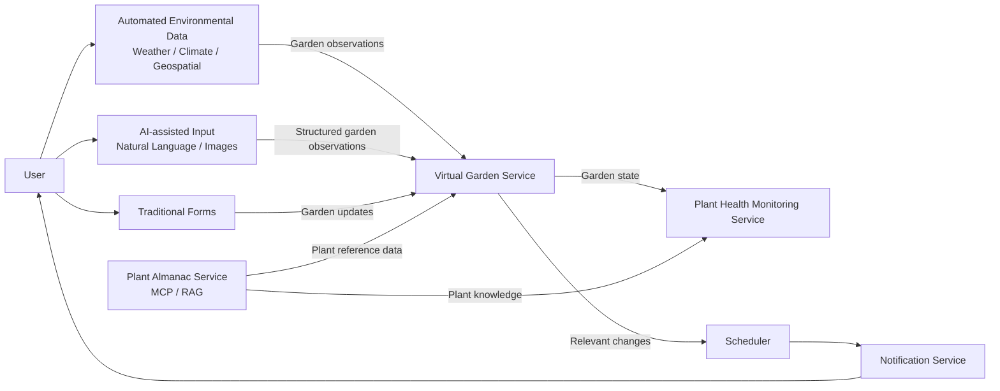
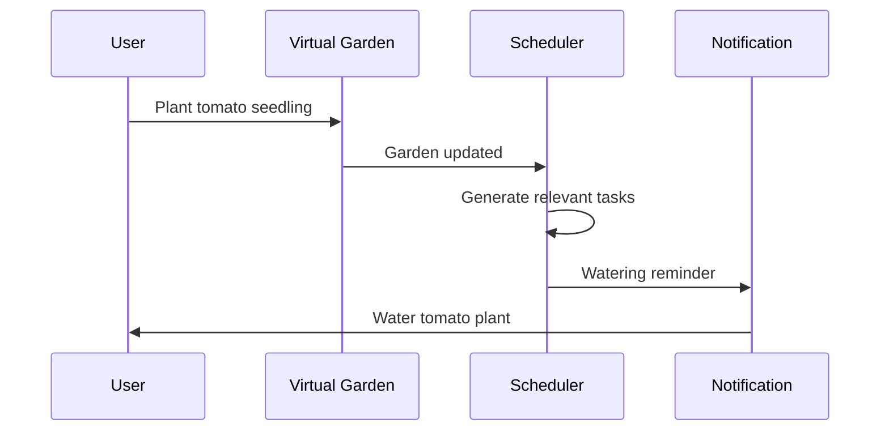
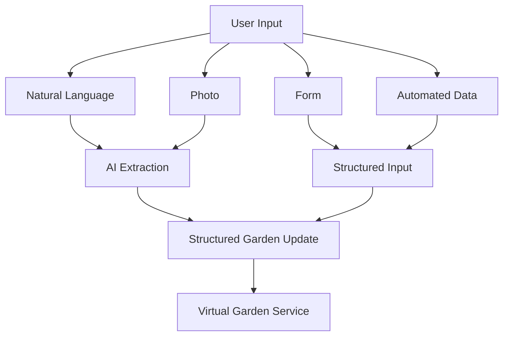
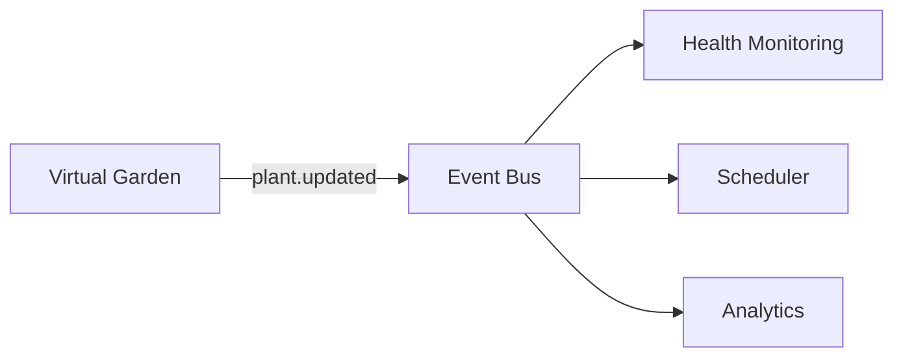

# Plant Management System

A smart plant management platform designed for **small home gardens**.

The system maintains a digital representation of a user's garden and combines information from manual input, environmental data, AI-assisted observations, and plant knowledge services to help users understand and manage their plants.

The project is built around a **microservice architecture**, with the **Virtual Garden Service** acting as the source of truth for the current state of a garden.

## github workflow / how we work 💪

branch → PR → review → merge.

service workflows cover contributor-owned areas. Amy's `plant_almanac.yml` runs
Ruff, Almanac tests, and an Almanac Docker build for relevant changes on `amy/**`.

shared CI:
- [`ruff.yml`](.github/workflows/ruff.yml) — lints every Python service on every PR and push to `main`
- [`integration-ci.yml`](.github/workflows/integration-ci.yml) — builds the stack, smoke-checks the endpoints, and tears it all down

before merging: CI is green, at least one review, no unresolved comments.

## for devs 🤓☝️ (amy,guhan,yunz)

all docker commands from the root (important!!)

### 1. start docker

open Docker Desktop, then check it's alive:

```bash
docker version
docker ps
```

### 2. start stuff

everything:

```bash
docker compose up -d --build
```

orrrr just what you need (the `proxy` is what publishes port 3000, so include it):

```bash
docker compose up -d --build proxy auth vgarden
docker compose up -d --build proxy auth ollama almanac
```

Everything is served through the nginx proxy on **one port, 3000**, and path-routed:

| service | url |
| --- | --- |
| frontend | http://localhost:3000/ |
| auth | http://localhost:3000/auth/account |
| vgarden | http://localhost:3000/vgarden/ |
| almanac | http://localhost:3000/almanac/ |
| almanac api | http://localhost:3000/almanac/api/plants |
| plant health | http://localhost:3000/health/plant-health-records/ |

### 3. logs, troubleshoot, stop

```bash
docker compose ps               # what's running
docker compose logs -f          # all logs
docker compose logs -f almanac  # one service
docker compose down             # stop (keeps data)
```

## Release 1: shared local MCP + RAG servers

Release 1 adds one shared **MCP server** and one shared **RAG server**. Both are plain
local processes — **not** compose services, by requirement — and every feature reaches
them only through its own backend/API. The containerised services find them at
`host.docker.internal` (configured in `docker-compose.yml`). Design and boundaries:
[docs/ai/mcp-rag-design.md](docs/ai/mcp-rag-design.md).

| | MCP | RAG |
| --- | --- | --- |
| what it is | a server that exposes named, typed **tools** an AI client can discover and call | retrieves passages from **your indexed records** and has the local model answer only from them, with citations and a confidence category |
| server | [`ai-services/mcp-server/`](ai-services/mcp-server/README.md) on `127.0.0.1:5105/mcp` | [`ai-services/rag-server/`](ai-services/rag-server/README.md) on `127.0.0.1:5106` |
| health backend routes | `GET /plant-health-records/tools`, `POST /plant-health-records/tools/run` | `POST /plant-health-records/ask`, `POST /plant-health-records/ask/sync` |
| health UI | *Tools* panel on the records page | *Ask about your records* panel on the records page |
| switch (CI sets `false`) | `MCP_ENABLED` | `RAG_ENABLED` |
| status | `GET /plant-health-records/integrations` | same |

Almanac / Virtual Garden tools and sources are registered stubs — see issues
#41–#44 and #46; the agentic loop's MCP/RAG validation modes are #45.

### Running and demonstrating it

**Where to run things.** Every command below is a **bash** command run from a shell at the
**repository root**, except the two `ollama` commands in the models step, which run
wherever Ollama is installed. With Docker in **WSL** (the setup used here) that shell is
your WSL Ubuntu terminal at `/mnt/c/.../Plant-Management-System`: the containers reach the
WSL side as `host.docker.internal`, so the two servers must run in WSL too, bound to all
interfaces (`MCP_HOST=0.0.0.0`, `RAG_HOST=0.0.0.0`). With **Docker Desktop** (Windows,
macOS or Linux), `host.docker.internal` reaches the host's own loopback, so run the same
commands from Git Bash or a macOS/Linux terminal and drop the `*_HOST` and `OLLAMA_URL`
overrides; on Windows/Git Bash use `python` instead of `python3` and `.venv-wsl/Scripts/`
instead of `.venv-wsl/bin/`. With native **Docker Engine on Linux** keep the `*_HOST`
overrides (`host.docker.internal` is the bridge gateway there) and drop only `OLLAMA_URL`.
None of these commands run in PowerShell.

**One-off: let WSL reach Ollama on Windows.** Ollama on Windows listens on `localhost`
only. Set the Windows environment variable `OLLAMA_HOST=0.0.0.0` (Ollama tray app →
Settings, or System Properties → Environment Variables) and restart Ollama. Skip this on
Docker Desktop, macOS/Linux, or if WSL uses mirrored networking (then `localhost` works
and you also drop the `OLLAMA_URL` override below).

**One-off: models.** On the machine running Ollama (in the WSL setup that is Windows:
use a PowerShell/cmd window, or `ollama.exe list` from WSL), check what is installed and
pull the chat model the RAG server will answer with (the example below uses `gemma3:4b`;
the default is `qwen3:4b-instruct`). A model that is not installed is pulled during the
first question, which takes minutes and outlasts the app's 180 s timeout. This host Ollama
is separate from the compose `ollama` container, which only the health service uses and
which terminal 3 pulls into separately:

```bash
ollama list
```

```bash
ollama pull gemma3:4b
```

Open **three terminals**, each at the repository root.

**Terminal 1 — shared MCP server (leave running)**

Create a virtualenv for the two servers and install their dependencies (first time only).
In WSL you may first need `sudo apt install python3-venv`; Python 3.10+ is required. The
name `.venv-wsl` avoids clobbering a Windows `.venv` at the same path:

```bash
python3 -m venv .venv-wsl && .venv-wsl/bin/pip install -r ai-services/mcp-server/requirements-dev.txt -r ai-services/rag-server/requirements-dev.txt
```

Start the MCP server. It registers the tools and serves them over streamable-http, and it
reads the health service through the proxy on `:3000`. Ready when it logs
`shared MCP server listening on http://0.0.0.0:5105/mcp (enabled=True)`:

```bash
MCP_HOST=0.0.0.0 .venv-wsl/bin/python ai-services/mcp-server/server.py
```

**Terminal 2 — shared RAG server (leave running)**

Start the RAG server. `OLLAMA_MODEL` is the installed chat model from the one-off step;
`RAG_EMBED_MODEL=` (empty) keeps retrieval lexical so no embedding model is needed;
`OLLAMA_URL` points at the Windows host from a NAT-mode WSL distro (drop it on Docker
Desktop, macOS/Linux, or mirrored-networking WSL). Ready when it logs
`shared RAG server listening on http://0.0.0.0:5106 (enabled=True)`:

```bash
RAG_HOST=0.0.0.0 RAG_EMBED_MODEL= OLLAMA_MODEL=gemma3:4b OLLAMA_URL=http://$(ip route | awk '/default/ {print $3}'):11434 .venv-wsl/bin/python ai-services/rag-server/app.py
```

Then, from any terminal, confirm the RAG server can reach Ollama. Expect `"reachable": true`
under `ai` (HTTP 200); `false` means revisit the two one-off steps above:

```bash
curl -s http://127.0.0.1:5106/healthz
```

**Terminal 3 — the application and the demo**

Build and start the containerised feature services. MCP and RAG are *not* services here;
compose only passes the health container their `host.docker.internal` URLs:

```bash
docker compose up -d --build
```

First time only: pull the health service's own vision model into the compose `ollama`
volume, otherwise the first assessment downloads ~3 GB inside the request:

```bash
docker compose exec ollama ollama pull qwen2.5vl:3b
```

Prove the containerised health backend is wired to both local servers (retries while the
containers finish starting). Expect `"enabled": true, "reachable": true` for both `mcp`
and `rag`:

```bash
curl -s --retry 10 --retry-delay 3 --retry-all-errors http://localhost:3000/health/plant-health-records/integrations
```

Create a record to ask about. This runs the health service's vision model in the compose
`ollama` container: tens of seconds on CPU once the model is pulled:

```bash
curl -s -X POST http://localhost:3000/health/plant-health-records/assessments -H 'Content-Type: application/json' -d '{"plant_ref":"Tomato, back bed","description":"Planted 6 weeks ago, lower leaves yellow, watered daily, soil stays wet."}'
```

**MCP interaction** through the health backend: the backend validates the tool and its
arguments, the MCP server runs it against the health API, and the structured result comes
back (`"is_error": false` with a `structured_content` object):

```bash
curl -s -X POST http://localhost:3000/health/plant-health-records/tools/run -H 'Content-Type: application/json' -d '{"tool":"summarise_plant_health_history","plant_ref":"Tomato, back bed"}'
```

Tool boundary: a tool that is not a Plant Health tool is refused by the backend before any
call is made. Expect HTTP `400`:

```bash
curl -s -X POST http://localhost:3000/health/plant-health-records/tools/run -H 'Content-Type: application/json' -d '{"tool":"search_almanac_catalogue"}'
```

**RAG interaction**: first tell the RAG server to index the health records. It pulls them
from the health API and splits each into citable passages; expect `"documents"` and
`"chunks"` counts:

```bash
curl -s -X POST http://localhost:3000/health/plant-health-records/ask/sync
```

Then ask. Expect an `answer`, `citations` pointing at assessment records, and a
`confidence` of `high`, `medium` or `low`:

```bash
curl -s -X POST http://localhost:3000/health/plant-health-records/ask -H 'Content-Type: application/json' -d '{"question":"What is wrong with the tomato in the back bed and what should I do?"}'
```

Insufficient-context response: nothing relevant is indexed, so `insufficient_context` is
`true`, `confidence` is `insufficient`, and the model is never called (`"model": null`):

```bash
curl -s -X POST http://localhost:3000/health/plant-health-records/ask -H 'Content-Type: application/json' -d '{"question":"What is the capital of France?"}'
```

The same interactions are available in the browser at
<http://localhost:3000/health/plant-health-records/> — the *Tools* panel and the
*Ask about your records* panel (click *Sync records to the knowledge base* first).

Direct terminal validation of the servers themselves, bypassing the app. Expect
`"service": "mcp-server"` with the nine registered tool names, and the same
answer/citations/confidence contract as through the app. For a protocol-level check
(list tools, call a tool with the MCP client) see
[ai-services/mcp-server/README.md](ai-services/mcp-server/README.md#validate-from-a-terminal):

```bash
curl -s http://127.0.0.1:5105/healthz
```

```bash
curl -s -X POST http://127.0.0.1:5106/rag/query -H 'Content-Type: application/json' -d '{"question":"What is wrong with my tomato?"}'
```

**CI mode — MCP and RAG disabled.** The feature workflows run with both modes off. To
reproduce that locally, stop the running stack so the health container is recreated with
the CI flags:

```bash
docker compose down
```

Export the flags for the whole shell, so both `docker compose` and the smoke script see
them:

```bash
export MCP_ENABLED=false RAG_ENABLED=false
```

Start the stack disabled, then run the same smoke test CI runs. It asserts that the health
UI is up, that `/integrations` reports both modes wired but disabled, and that `/tools/run`
and `/ask` answer `503` without contacting any server:

```bash
docker compose up -d --build && bash scripts/test/smoke-health.sh http://127.0.0.1:3000
```

Clear the flags again before a normal `docker compose up`, or the modes stay off:

```bash
unset MCP_ENABLED RAG_ENABLED
```

Stop everything: `docker compose down` in terminal 3, `Ctrl+C` in terminals 1 and 2.

## Agentic AI workflow

The almanac and virtual-garden chat answers run through an explicit
**Plan → Act → Observe → Adapt** loop (a second model reviews each draft; the loop
revises until approved). Every phase is logged for evidence — stdout, JSONL, and a
per-run transcript. See **[docs/agentic-ai-workflow.md](docs/agentic-ai-workflow.md)**
and `python tools/ai-loop/view.py`.

How AI is designed, prompted, grounded, and made auditable across **every**
microservice is documented in **[docs/ai/](docs/ai/README.md)** — architecture,
context management, prompt engineering, and the agentic workflow.

## Overview

Users can describe and update their garden through several input methods:

* **Natural language**

  * "I planted two tomato seedlings today."
  * "The basil leaves are starting to turn yellow."
* **Photos**

  * Images of plants, leaves, pests, soil, etc.
* **Traditional forms**

  * Planting dates
  * Watering
  * Fertilising
  * Pruning
  * Harvesting
* **Automatically collected data**

  * Weather
  * Climate
  * Geospatial information
  * Other environmental data

AI can be used to convert less structured inputs such as text and images into structured garden observations.

These observations ultimately update the user's **Virtual Garden**.

---

## Architecture


```mermaid
flowchart LR
    User[User]

    Weather[Automated Environmental Data<br/>Weather / Climate / Geospatial]
    AI[AI-assisted Input<br/>Natural Language / Images]
    Forms[Traditional Forms]

    VG[Virtual Garden Service]

    Almanac[Plant Almanac Service<br/>MCP / RAG]
    Health[Plant Health Monitoring Service]

    Scheduler[Scheduler]
    Notify[Notification Service]

    User --> Weather
    User --> AI
    User --> Forms

    Weather -->|Garden observations| VG
    AI -->|Structured garden observations| VG
    Forms -->|Garden updates| VG

    Almanac -->|Plant reference data| VG

    VG -->|Garden state| Health
    Almanac -->|Plant knowledge| Health

    VG -->|Relevant changes| Scheduler
    Scheduler --> Notify
    Notify --> User
```

---

## Core Services

### Virtual Garden Service

The **Virtual Garden Service** maintains the current representation of a user's physical garden.

Examples of information it may store include:

* Gardens
* Garden beds
* Plants
* Plant locations
* Species/variety references
* Planting dates
* Growth stages
* Watering events
* Fertilisation events
* Pruning events
* Harvest events
* User observations
* Environmental observations
* Plant state/history

The service should be concerned with **representation, not interpretation**.

For example:

> "The tomato plant has three yellow leaves."

is valid garden state.

Determining:

> "The tomato plant probably has a nitrogen deficiency."

belongs to the **Plant Health Monitoring Service**.

### Virtual Garden Design Principles

The Virtual Garden Service should:

* Maintain the authoritative representation of the garden.
* Accept structured updates from different input methods.
* Keep historical garden events where appropriate.
* Validate references against other services when required.
* Expose garden state to other services.
* Publish relevant changes for downstream systems.

It should **not**:

* Diagnose plant diseases.
* Determine whether a plant is healthy.
* Generate gardening advice.
* Perform complex plant knowledge retrieval.
* Duplicate information owned by another service.
* Maintain a global database containing every piece of system data.

When information belongs to another domain, the Virtual Garden Service should query the service responsible for it.

---

## Plant Almanac Service

The **Plant Almanac Service** provides general knowledge about plants.

### Current implementation

The current service provides public plant reference pages and APIs plus an authenticated,
Ollama-powered chat at <http://localhost:3000/almanac/>.

See [the Plant Almanac microservice README](almanac/README.md) for setup, architecture,
endpoints, configuration, tests, and persistence.

### Intended knowledge scope

Examples include:

* Plant species
* Cultivars
* Expected growth characteristics
* Preferred soil
* Sunlight requirements
* Water requirements
* Temperature tolerances
* Seasonal information
* Companion planting information
* Common diseases
* Common pests
* Gardening recommendations

The service may use:

* Structured plant databases
* Retrieval-Augmented Generation (**RAG**)
* Large language models
* External horticultural datasets

Other services should query the Almanac rather than maintaining their own copies of this information.

The service should also be queryable through **MCP**, allowing AI assistants to access plant knowledge directly.

---

## Plant Health Monitoring Service

The **Plant Health Monitoring Service** analyses the current state of the garden.

It combines:

1. The user's actual garden state from the **Virtual Garden Service**
2. Expected plant characteristics from the **Plant Almanac Service**

For example:

```text
Virtual Garden

Tomato Plant
- planted 6 weeks ago
- leaves becoming yellow
- watered every day
- soil currently very wet

        +

Plant Almanac

Tomato
- prefers well-draining soil
- excessive watering may cause root problems

        ↓

Plant Health Monitoring

Potential overwatering detected.
```

The health service can perform tasks such as:

* Detecting abnormal plant conditions
* Identifying possible diseases
* Detecting pest symptoms
* Recognising watering problems
* Comparing growth against expected growth stages
* Identifying environmental stress
* Producing health scores
* Generating recommendations

This separation keeps health interpretation outside of the Virtual Garden domain.

---

## Scheduler

Garden changes can create or modify future tasks.

For example, adding:

```text
Planted tomato seedlings today.
```

may generate:

```text
Water seedlings
Check seedling establishment
Fertilise
Inspect growth
Expected harvest period
```

If the Virtual Garden changes, relevant scheduled tasks can be recalculated.


```mermaid
sequenceDiagram
    participant User
    participant VG as Virtual Garden
    participant Scheduler
    participant Notification

    User->>VG: Plant tomato seedling
    VG->>Scheduler: Garden updated
    Scheduler->>Scheduler: Generate relevant tasks

    Scheduler->>Notification: Watering reminder
    Notification->>User: Water tomato plant
```

---

## Notifications

The notification system delivers time-sensitive garden information to users.

Possible notifications include:

* Watering reminders
* Fertilising reminders
* Pruning reminders
* Plant health warnings
* Pest alerts
* Frost warnings
* Heat warnings
* Harvest reminders
* Seasonal gardening tasks

Notifications should generally be produced from events generated by other services rather than implementing gardening logic themselves.

---

## Data Input Pipeline

Different forms of user input should ultimately result in a common structured representation.


```mermaid
flowchart TD
    A[User Input]

    A --> B[Natural Language]
    A --> C[Photo]
    A --> D[Form]
    A --> E[Automated Data]

    B --> F[AI Extraction]
    C --> F
    D --> G[Structured Input]
    E --> G

    F --> H[Structured Garden Update]
    G --> H

    H --> I[Virtual Garden Service]
```

For example:

```text
User:
"I planted three basil plants in the herb bed yesterday."
```

could become:

```json
{
  "action": "plant",
  "plant": {
    "species": "basil",
    "quantity": 3
  },
  "location": "herb-bed",
  "planted_at": "2026-08-20"
}
```

The Virtual Garden Service then validates and records the update.

---

## Event-Driven Communication

Where appropriate, changes to the Virtual Garden should produce domain events.

For example:

```text
plant.created
plant.updated
plant.removed

watering.recorded
fertilising.recorded
observation.created

garden.updated
```

Other services can subscribe to these events without tightly coupling themselves to the Virtual Garden implementation.


```mermaid
flowchart LR
    VG[Virtual Garden]

    VG -->|plant.updated| Bus[Event Bus]

    Bus --> Health[Health Monitoring]
    Bus --> Scheduler[Scheduler]
    Bus --> Analytics[Analytics]
```

For operations requiring an immediate response, services can communicate synchronously through APIs or MCP.

---

## Example User Flow

A user notices unusual leaves on their tomato plant.

### 1. User submits a photo

```text
"This tomato plant looks weird."
```

### 2. AI processes the input

The AI extracts observations such as:

```text
Plant: Tomato #3
Observation:
- several lower leaves are yellow
- leaf edges appear brown
```

### 3. Virtual Garden is updated

The Virtual Garden records the observation without diagnosing it.

### 4. Health Monitoring receives the change

It retrieves:

```text
Virtual Garden:
- current plant state
- watering history
- environmental conditions
```

and combines it with:

```text
Plant Almanac:
- tomato disease information
- nutrient requirements
- environmental tolerances
```

### 5. Health Monitoring produces an assessment

For example:

```text
Possible overwatering.

Confidence: 72%

The plant has been watered frequently and the soil has
remained wet for several days.
```

### 6. User receives a notification

The application can surface the warning and recommended actions.

---

## Service Boundaries

| Service                  | Responsibility                                          |
| ------------------------ | ------------------------------------------------------- |
| **Virtual Garden**       | Represent the user's real garden                        |
| **Plant Almanac**        | Provide general plant knowledge                         |
| **Health Monitoring**    | Interpret garden state and detect problems              |
| **Scheduler**            | Maintain future garden tasks                            |
| **Notification Service** | Deliver alerts and reminders                            |
| **AI Input Layer**       | Convert unstructured input into structured observations |

A useful rule is:

> **The Virtual Garden stores what is happening. Other services determine what it means.**

---

## AI Integration

AI is intended to complement the system rather than replace clear service boundaries.

Potential AI use cases include:

* Natural-language garden updates
* Image understanding
* Plant identification
* Observation extraction
* Conversational garden management
* Plant health reasoning
* RAG over gardening literature
* Recommendation generation

For example, a user should eventually be able to say:

```text
How are my tomatoes doing?
```

An AI assistant could query:

```text
Virtual Garden
    ↓
current tomato plants

Health Monitoring
    ↓
current health assessments

Plant Almanac
    ↓
relevant tomato knowledge
```

and combine the responses into a useful answer.

Services should therefore expose queryable interfaces, with **MCP** being particularly useful for AI-assisted interactions.

---

## Project Goals

The system is primarily intended for **small gardens**, including:

* Backyard gardens
* Courtyard gardens
* Balcony gardens
* Raised garden beds
* Community garden plots
* Small greenhouse setups

The goal is not to build an enterprise farm management platform.

Instead, the project aims to make managing a small garden easier by creating a continuously updated digital model of the garden that other intelligent services can reason over.

---

## Initial MVP

A reasonable first version of the system could support:

* Creating a garden
* Creating garden beds/areas
* Adding plants
* Recording plant locations
* Recording watering
* Recording fertilising
* Recording observations
* Natural-language updates
* Basic image observations
* Plant Almanac lookup
* Basic plant health assessments
* Scheduled watering reminders
* Notifications
* Garden history

More sophisticated features can then be added without expanding the responsibilities of the core Virtual Garden Service.

---

## Long-Term Vision

The system should eventually allow a user to manage their garden conversationally.

For example:

```text
User:
I planted three tomato seedlings in the north bed.

Assistant:
Added three tomato seedlings to the north bed.
```

Later:

```text
User:
Do I need to do anything in the garden today?

Assistant:
Your basil is due for watering.

Your tomato plants look healthy, although the expected
temperature tomorrow is unusually high. Consider watering
them early in the morning.
```

The underlying system remains modular:

```text
                ┌──────────────────────┐
                │    AI Assistant      │
                └──────────┬───────────┘
                           │ MCP / APIs
          ┌────────────────┼────────────────┐
          │                │                │
          ▼                ▼                ▼
    Virtual Garden   Plant Almanac   Health Monitoring
          │
          ▼
      Scheduler
          │
          ▼
    Notifications
```

This keeps the architecture extensible while ensuring that each service has a clear and maintainable responsibility.

---

## Running the Frontend Locally

The pages under `shared/frontend/templates/` are Jinja templates (e.g. `index.html` starts with ``), so opening them directly as local files won't work — they need to be rendered by Flask.

From `shared/frontend/`:

```bash
python3 -m venv .venv
source .venv/bin/activate        # Windows: .venv\Scripts\activate
pip install -r requirements.txt
python app.py
```

Run this way, the standalone frontend is on **http://127.0.0.1:5000**.

Or, with Docker, from the repository root (brings up every service behind the proxy):

```bash
docker compose up --build
```

Then open **http://127.0.0.1:3000** in your browser.
