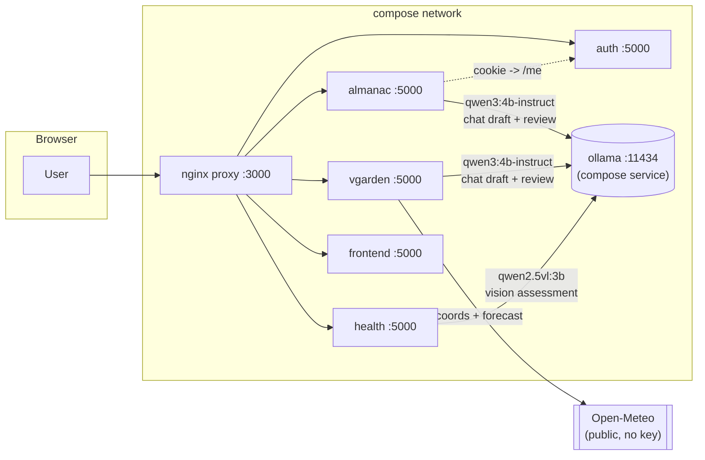
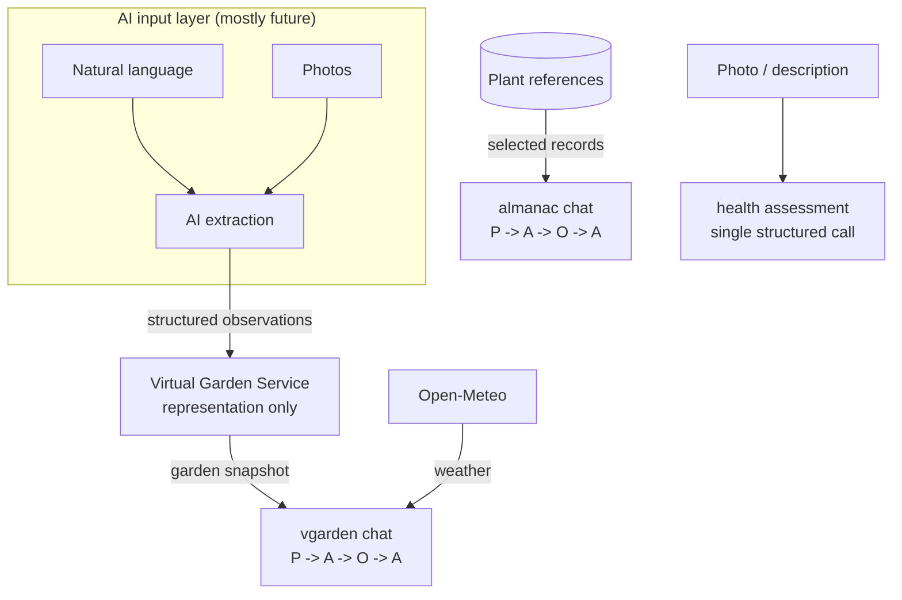

# AI architecture

## Local-first inference — the non-negotiable

Every model call in the project goes to a **locally hosted [Ollama](https://ollama.com)
instance**. No prompt, photo, garden snapshot, or plant record is ever sent to a
third-party API. This is a hard constraint, not a default:

- `health/` states it in the service README and in `health/ai.py`'s module
  docstring: *"images and descriptions are sent to an Ollama instance on the
  local network and never to a third party."*
- `almanac/ai.py` and `vgarden/ai.py` both open with *"all inference stays on a
  locally hosted Ollama instance."*
- The only outbound internet call anywhere near the AI path is `vgarden/weather.py`
  hitting Open-Meteo for coordinates and a forecast — public data, no API key,
  no user content in the request.

## Topology



`docker-compose.yml` defines one `ollama` service on the internal network.
`almanac`, `vgarden`, and `health` all reach it at `http://ollama:11434`
(`OLLAMA_URL`). Models are pulled on first use (`OLLAMA_AUTO_PULL=true`) and
cached in the `ollama-models` volume. `OLLAMA_KEEP_ALIVE=30m` and
`OLLAMA_MAX_LOADED_MODELS=1` keep one model resident so repeat calls skip the
multi-second load.

> **Historic note:** the `almanac/` README table and a comment in
> `docker-compose.yml` still mention `host.docker.internal:11434` (an earlier
> setup where almanac/vgarden used the host's own Ollama). The actual service
> definitions in the committed `docker-compose.yml` set
> `OLLAMA_URL=http://ollama:11434` for all three services — treat that as the
> source of truth.

### GPU

CPU inference is ~10× slower. `docker-compose.gpu.yml` is an opt-in override that
reserves an NVIDIA GPU for the `ollama` service:

```bash
docker compose -f docker-compose.yml -f docker-compose.gpu.yml up
```

## Model matrix

| Model | Used by | Role | Why this model |
|---|---|---|---|
| `qwen3:4b-instruct` | almanac, vgarden (ACT); `tools/ai-dev` (proposer) | Draft the answer / proposal from the grounding | Instruction-tuned, reads JSON grounding carefully, approves well-grounded drafts on the first reviewer pass, small enough for CPU dev |
| `llama3.1:8b` | almanac, vgarden (OBSERVE); `tools/ai-dev` (reviewer) | Independently review the draft against the same grounding | A *different* family from the proposer (independence), noticeably stricter — good for catching unsupported claims |
| `qwen2.5vl:3b` | health | Vision + text plant-health assessment | Fastest vision model that still returned valid structured output in every test case (see `health/README.md` perf table); `moondream` was smaller but failed text-only JSON |

Configuration knobs (per service, via env — see each service README and
[`context-management.md`](context-management.md) for the budgets):

| Env var | Meaning |
|---|---|
| `OLLAMA_URL` | Ollama endpoint (`http://ollama:11434` in compose) |
| `OLLAMA_MODEL` | Proposer / assessment model |
| `OLLAMA_REVIEW_MODEL` | Reviewer model (almanac, vgarden); empty ⇒ single-shot |
| `OLLAMA_AUTO_PULL` | Pull the model on first use if missing |
| `OLLAMA_KEEP_ALIVE` | How long a model stays resident (health; `30m`) |
| `OLLAMA_TIMEOUT` / `OLLAMA_PULL_TIMEOUT` | Request / pull timeouts |
| `AI_LOOP_MAX_ITERATIONS` | Max ACT/OBSERVE rounds (default 2) |
| `AI_LOOP_LOG_DIR` | Where JSONL + transcripts are written |

## Where AI sits in the domain

The project's rule is **"the Virtual Garden stores what is happening; other
services determine what it means."** AI lives on the *interpretation* side and
the *input* side, never inside the Virtual Garden's representation:



## Not built yet

These directories are committed as placeholders (`.keep` files) and represent the
intended expansion. Nothing in them runs today; the architecture doc in the root
README describes the target shape.

| Path | Intended role |
|---|---|
| `ai-services/mcp-server/` | Expose Plant Almanac knowledge over **MCP** so external AI assistants can query it directly |
| `ai-services/rag-server/` | **RAG** over gardening literature to back Almanac answers |
| `ai-services/multi-agent-server/` | Orchestrate multiple specialised agents across services for a single user question |
| `ai-services/ai-mode/` | A conversational "manage my garden" front door spanning vgarden + almanac + health |
| `ai-input/` | Convert unstructured natural-language / image input into structured Virtual Garden updates |

When any of these is implemented, add a row to the service map in
[`README.md`](README.md) and a grounding section to
[`context-management.md`](context-management.md).
