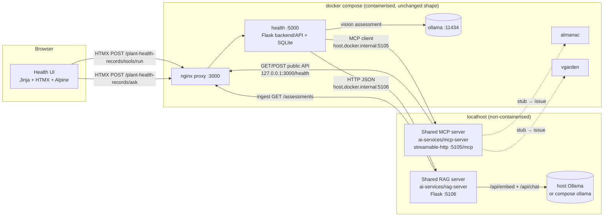

# MCP + RAG design (Release 1, scoped to the Plant Health service)

This page is the design for extending the Release 0 application with the two shared
Release 1 components — a **shared local MCP server** and a **shared local RAG server** —
and for wiring the **Plant Health** feature to both. It follows the Release 1 brief:

- One shared MCP server and one shared RAG server, both **non-containerised**, running on
  `localhost`, and used by every student feature.
- Each feature's **frontend reaches MCP and RAG only through its own backend/API**.
- RAG answers are **grounded**: retrieved context, **source citations**, a **confidence
  category**, and an explicit **insufficient-context** response when nothing relevant
  is retrieved.
- `docker-compose.yml` keeps deploying the containerised feature services and is only
  updated with the **connection configuration** to the local servers (the same
  `host.docker.internal` approach that was used for the local AI mode). MCP, RAG and the
  agentic loop are **not** compose services.
- Feature CI workflows keep the integration but run with **MCP and RAG disabled**.
- Every model call stays on **local Ollama** (see [`architecture.md`](architecture.md)).

The scope of this design is the Plant Health service. The Almanac and Virtual Garden
parts of the shared servers are registered as **explicit stubs** that return a
"not implemented" tool error / `501`, each tracked by a GitHub issue, so the other
features can fill them in without changing the shared contract.

---

## 1. Where the new pieces sit



Key boundary decisions:

| Decision | Why |
| --- | --- |
| The MCP server talks to features **only through their public HTTP APIs** (via the proxy on `:3000`), never their databases. | Same rule as the Almanac adapter in PR #36; tools cannot choose an origin, method or path, so a compromised tool call cannot reach another service's private data. |
| The health **backend** owns the MCP/RAG clients; the browser never contacts `:5105`/`:5106`. | Release 1 requires frontend access *through* the backend/API. It also lets CI disable both modes with two env vars. |
| Both servers are plain Python processes started from the repo root. | Release 1 forbids containerising them. Compose only carries `MCP_SERVER_URL`/`RAG_SERVER_URL` pointing at `host.docker.internal`. |
| `MCP_ENABLED` / `RAG_ENABLED` are honoured in the health service **and** in the servers themselves. | CI sets both to `false`; the UI then shows a clear "disabled" state instead of a connection error, and the servers refuse tool calls when switched off. |

---

## 2. Shared MCP server — `ai-services/mcp-server/`

**Stack:** official Python SDK `mcp==2.2.0` (`MCPServer`), `httpx` for the outbound
calls. Transport **streamable-http** on `127.0.0.1:5105/mcp` (`stateless_http`,
`json_response`) so containers and terminals can both reach it; `stdio` is available for
desktop MCP hosts. DNS-rebinding protection stays on with an explicit allow-list
(`127.0.0.1:*`, `localhost:*`, `host.docker.internal:*`).

### Registered tools

| Tool | Feature | Inputs | Result | Boundary |
| --- | --- | --- | --- | --- |
| `health_service_status` | health | — | `{status, ai_reachable, model, url}` | read-only |
| `list_health_assessments` | health | `plant_ref?`, `status?`, `limit 1..50` | `{items:[AssessmentSummary], count}` | read-only; never returns image bytes |
| `get_health_assessment` | health | `assessment_id ≥ 1` | full `Assessment` (no image) | read-only |
| `summarise_plant_health_history` | health | `plant_ref`, `limit ≤ 50` | `{plant_ref, assessments, status_counts, latest, score_trend, recurring_issues}` | read-only; computed in code, no model call |
| `assess_plant_health` | health | `description 1..4000`, `plant_ref? ≤200` | new `Assessment` | **creates a record** (annotated non-read-only, non-destructive); text only — photos are not accepted over MCP |
| `search_almanac_catalogue` | almanac | `query`, `kind`, `limit` | `SearchPage` | **stub** — tracked issue |
| `get_almanac_plant` | almanac | `slug` | `PlantDetail` | **stub** — tracked issue |
| `get_garden_snapshot` | vgarden | `garden_id` | garden snapshot | **stub** — tracked issue |
| `list_garden_plantings` | vgarden | `garden_id` | plantings | **stub** — tracked issue |

Also exposed: resource `health://assessments/{id}`, resource `pms://about`
(instructions), prompt `review_plant_health_history(plant_ref)`.

Every tool: validated inputs (pydantic `Annotated` constraints), a pinned pydantic
output model (published as `outputSchema`), `ToolAnnotations`, and expected failures
surfaced as `ToolError` text (service down, 404, disabled) — never invented data.
Stubs raise `ToolError("… is not implemented in the shared MCP server yet (issue #N)")`
so discovery shows the full contract while the behaviour is honest.

### Configuration

| Env | Default | Purpose |
| --- | --- | --- |
| `MCP_ENABLED` | `true` | `false` → every tool call returns a "disabled" error; discovery still works |
| `MCP_HOST` / `MCP_PORT` | `127.0.0.1` / `5105` | Listener. Set `MCP_HOST=0.0.0.0` only if containers cannot reach the host loopback. |
| `MCP_ALLOWED_HOSTS` | `127.0.0.1:*,localhost:*,host.docker.internal:*` | Host-header allow-list |
| `HEALTH_SERVICE_URL` | `http://127.0.0.1:3000/health` | Public health API (through the proxy) |
| `ALMANAC_SERVICE_URL`, `VGARDEN_SERVICE_URL` | `http://127.0.0.1:3000/almanac`, `…/vgarden` | Reserved for the stubs |

---

## 3. Shared RAG server — `ai-services/rag-server/`

**Stack:** Flask + Jinja/HTMX (project stack), SQLite chunk store, pure-Python BM25,
optional dense embeddings from local Ollama (`/api/embed`), grounded generation through
local Ollama (`/api/chat`) with a pinned JSON schema at `temperature 0`.

### Knowledge sources

| Source | Status | How it is ingested |
| --- | --- | --- |
| `health` — past plant health assessments | **implemented** | `POST /rag/ingest/health` pulls `GET /plant-health-records/assessments` from the health API and chunks each record into: summary, issues, recommendations, missing information. Each chunk carries `source_id` (assessment id), a title, a URL back to the record, and the timestamp. Re-ingesting is idempotent (upsert by `source:source_id:part`). |
| `almanac` — plant reference records | stub (`501`) | tracked issue |
| `vgarden` — garden state | stub (`501`) | tracked issue |

### Retrieval → grounding → answer

```
question ──► tokenise ──► BM25 over chunks ──┐
                        └─► (optional) Ollama embed ─► cosine ──┤ hybrid rank
                                                                ▼
                  relevance gate: coverage ≥ RAG_MIN_COVERAGE or cosine ≥ RAG_MIN_SIMILARITY
                        │ nothing passes ──► {insufficient_context: true, confidence: "insufficient"}
                        ▼
              grounding JSON = top-k chunks (id, source, title, text, date)
                        ▼
              Ollama chat, format = ANSWER_SCHEMA, temperature 0
              {answer, cited_chunk_ids[], evidence_strength, insufficient_context}
                        ▼
              code re-validates: cited ids ⊆ retrieved ids; model "insufficient" ⇒ refuse
              confidence category derived in code (see below)
```

**Confidence category** (computed in code, not self-reported alone):

| Category | Rule |
| --- | --- |
| `insufficient` | no chunk passed the relevance gate, or the model set `insufficient_context` |
| `high` | ≥ 2 cited chunks, top relevance ≥ 0.6, model `evidence_strength = strong` |
| `medium` | otherwise, when ≥ 1 cited chunk and model strength ≥ `moderate` |
| `low` | 1 weak citation, or model strength `weak` |

### Endpoints

| Method | Path | Purpose |
| --- | --- | --- |
| `GET` | `/healthz` | liveness + Ollama reachability + chunk count |
| `GET` | `/rag/sources` | indexed sources with document/chunk counts |
| `POST` | `/rag/ingest/<source>` | (re)index a source; `501` for stubs |
| `POST` | `/rag/query` | `{question, sources?, top_k?}` → grounded answer (schema above) |
| `GET` | `/` | small HTMX page to query the server directly (terminal/UI validation) |

### Configuration

`RAG_ENABLED`, `RAG_HOST`/`RAG_PORT` (`127.0.0.1:5106`), `RAG_DATABASE_URL` (SQLite),
`HEALTH_SERVICE_URL`, `OLLAMA_URL`, `OLLAMA_MODEL` (answering), `RAG_EMBED_MODEL`
(`nomic-embed-text`; empty → lexical only), `RAG_TOP_K` (5), `RAG_MIN_COVERAGE` (0.34),
`RAG_MIN_SIMILARITY` (0.45).

---

## 4. Plant Health service changes

| Layer | Change |
| --- | --- |
| Config | `MCP_ENABLED`, `MCP_SERVER_URL`, `RAG_ENABLED`, `RAG_SERVER_URL` |
| Backend/API | `GET  /plant-health-records/integrations` — status of both integrations (used by the CI smoke test to prove they are wired but disabled)<br/>`GET  /plant-health-records/tools` — tool list from the MCP server<br/>`POST /plant-health-records/tools/run` — run one whitelisted health tool; JSON or HTMX fragment<br/>`POST /plant-health-records/ask` — RAG question about the user's records; JSON or HTMX fragment with citations + confidence<br/>`POST /plant-health-records/ask/sync` — ask the RAG server to re-ingest health records |
| Frontend | Two new panels on the records page: **Tools (MCP)** and **Ask about your records (RAG)**, HTMX-driven, rendering `_mcp_result.html` / `_rag_answer.html`. The RAG card shows the confidence badge, the cited records (linked), and the insufficient-context state. When a mode is disabled the panel says so. |
| API additions used by the servers | `GET /plant-health-records/assessments?since=&offset=` for incremental ingestion; `status=` filter for the MCP list tool |
| Tests | `health/tests/`: CRUD e2e, MCP/RAG routes with an in-process MCP server and a fake RAG server, disabled-mode behaviour |
| CI | `health.yml` becomes a real workflow: ruff, pytest (health + ai-services), docker build, and a compose smoke test with `MCP_ENABLED=false RAG_ENABLED=false` |

---

## 5. Delivery plan

| Branch / PR | Content |
| --- | --- |
| `claude/mcp-server-stubs` | this design page; shared MCP server skeleton with every tool registered as a validated stub; discovery/transport tests; ai-services CI |
| `claude/rag-server-base` | RAG server app factory, config, store skeleton, endpoint stubs (`501`), UI shell, tests |
| `claude/health-mcp-rag-integration` | health tools + RAG health source implemented; health backend routes, UI panels, compose connection config, health CI + smoke test; issues for the Almanac/Virtual Garden stubs and the agentic-loop validation modes |

Out of scope here (group responsibilities, tracked as issues): Almanac and Virtual
Garden tool/source implementations, and the shared agentic loop's MCP/RAG validation
modes in `shared/ai_loop.py` / `tools/ai-loop/`.
