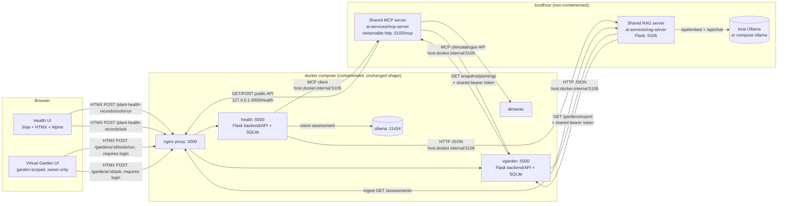

# MCP + RAG design (Release 1)

This page is the design for extending the Release 0 application with the two shared
Release 1 components — a **shared local MCP server** and a **shared local RAG server** —
and for wiring every student feature (Plant Health, Plant Almanac, Virtual Garden) to
both. It follows the Release 1 brief:

- One shared MCP server and one shared RAG server, both **non-containerised**, running on
  `localhost`, and used by every student feature.
- Each feature's **frontend reaches MCP and RAG only through its own backend/API**.
- RAG answers are **grounded**: retrieved context, **source citations**, a **confidence
  category**, and an explicit **insufficient-context** response when nothing relevant
  is retrieved.
- `docker-compose.yml` keeps deploying the containerised feature services and is only
  updated with the **connection configuration** to the local servers (the same
  `host.docker.internal` approach that was used for the local AI mode). MCP, RAG and the
  agentic loop are **not** compose services.
- Feature CI workflows keep the integration but run with **MCP and RAG disabled**.
- Every model call stays on **local Ollama** (see [`architecture.md`](architecture.md)).

Plant Health, Plant Almanac and Virtual Garden all implement the shared tools and
sources. Virtual Garden is the one case where the underlying feature data is
**private per-owner** rather than public reference data, which changes two things
documented in §4 below: its MCP/RAG endpoints on the feature side require the
shared service-token bearer (not a public, unauthenticated API like Almanac's
catalogue or Health's assessment list), and its RAG retrieval is scoped by a
`source_id` filter so one owner's question is never grounded in another owner's
garden.

---

## 1. Where the new pieces sit



Key boundary decisions:

| Decision | Why |
| --- | --- |
| The MCP server talks to features **only through their public HTTP APIs** (via the proxy on `:3000`), never their databases. | Same rule as the Almanac adapter in PR #36; tools cannot choose an origin, method or path, so a compromised tool call cannot reach another service's private data. |
| Each feature's **backend** owns the MCP/RAG clients; the browser never contacts `:5105`/`:5106`. | Release 1 requires frontend access *through* the backend/API. It also lets CI disable both modes with two env vars. |
| Both servers are plain Python processes started from the repo root. | Release 1 forbids containerising them. Compose only carries `MCP_SERVER_URL`/`RAG_SERVER_URL` pointing at `host.docker.internal`. |
| `MCP_ENABLED` / `RAG_ENABLED` are honoured in every feature service **and** in the servers themselves. | CI sets both to `false`; the UI then shows a clear "disabled" state instead of a connection error, and the servers refuse tool calls when switched off. |
| Virtual Garden's snapshot/plantings/export endpoints require the **shared service-token bearer** (the same `INTER_SERVICE_SECRET` vgarden already uses for auth's server-to-server calls), unlike Almanac's catalogue or Health's assessment list, which are public. | Garden state is private per-owner; a public, unauthenticated bulk endpoint would let anyone read every gardener's layout. The token is tool-supplied, never a tool argument, so an MCP/RAG caller cannot forge or omit it. |
| Virtual Garden's MCP tools always use the `garden_id` from the authenticated route, never a client-supplied argument; its RAG queries always carry `source_id=str(garden_id)`. | These are what stop one owner's tool call or question from ever reaching, or being grounded in, a different owner's garden. See `vgarden/integrations.py` and `ai-services/rag-server/store.py`'s `source_id` filter. |

---

## 2. Shared MCP server — `ai-services/mcp-server/`

**Stack:** official Python SDK `mcp==2.2.0` (`MCPServer`), `httpx` for the outbound
calls. Transport **streamable-http** on `127.0.0.1:5105/mcp` (`stateless_http`,
`json_response`) so containers and terminals can both reach it; `stdio` is available for
desktop MCP hosts. DNS-rebinding protection stays on with an explicit allow-list
(`127.0.0.1:*`, `localhost:*`, `host.docker.internal:*`).

### Registered tools

| Tool | Feature | Inputs | Result | Boundary |
| --- | --- | --- | --- | --- |
| `health_service_status` | health | — | `{status, ai_reachable, model, url}` | read-only |
| `list_health_assessments` | health | `plant_ref?`, `status?`, `limit 1..50` | `{items:[AssessmentSummary], count}` | read-only; never returns image bytes |
| `get_health_assessment` | health | `assessment_id ≥ 1` | full `Assessment` (no image) | read-only |
| `summarise_plant_health_history` | health | `plant_ref`, `limit ≤ 50` | `{plant_ref, assessments, status_counts, latest, score_trend, recurring_issues}` | read-only; computed in code, no model call |
| `assess_plant_health` | health | `description 1..4000`, `plant_ref? ≤200` | new `Assessment` | **creates a record** (annotated non-read-only, non-destructive); text only — photos are not accepted over MCP |
| `search_almanac_catalogue` | almanac | `query`, `kind`, `limit` | `SearchPage` | implemented |
| `get_almanac_plant` | almanac | `slug` | `PlantDetail` | implemented |
| `get_garden_snapshot` | vgarden | `garden_id` | garden snapshot (areas, containers, plantings) | implemented; calls vgarden's service-token-authenticated `GET /gardens/:id/snapshot` |
| `list_garden_plantings` | vgarden | `garden_id` | plantings | implemented; calls vgarden's service-token-authenticated `GET /gardens/:id/plantings` |

Also exposed: resource `health://assessments/{id}`, resource `pms://about`
(instructions), prompt `review_plant_health_history(plant_ref)`.

Every tool: validated inputs (pydantic `Annotated` constraints), a pinned pydantic
output model (published as `outputSchema`), `ToolAnnotations`, and expected failures
surfaced as `ToolError` text (service down, 404, disabled) — never invented data.
Stubs raise `ToolError("… is not implemented in the shared MCP server yet (issue #N)")`
so discovery shows the full contract while the behaviour is honest.

### Configuration

| Env | Default | Purpose |
| --- | --- | --- |
| `MCP_ENABLED` | `true` | `false` → every tool call returns a "disabled" error; discovery still works |
| `MCP_HOST` / `MCP_PORT` | `127.0.0.1` / `5105` | Listener. Set `MCP_HOST=0.0.0.0` only if containers cannot reach the host loopback. |
| `MCP_ALLOWED_HOSTS` | `127.0.0.1:*,localhost:*,host.docker.internal:*` | Host-header allow-list |
| `HEALTH_SERVICE_URL` | `http://127.0.0.1:3000/health` | Public health API (through the proxy) |
| `ALMANAC_SERVICE_URL`, `VGARDEN_SERVICE_URL` | `http://127.0.0.1:3000/almanac`, `…/vgarden` | Almanac public catalogue API; Virtual Garden snapshot API (through the proxy) |
| `VGARDEN_SERVICE_TOKEN` | `dev-inter-service-secret-change-me` | Bearer token for vgarden's private snapshot/plantings endpoints — must match vgarden's own `INTER_SERVICE_SECRET` |

---

## 3. Shared RAG server — `ai-services/rag-server/`

**Stack:** Flask + Jinja/HTMX (project stack), SQLite chunk store, pure-Python BM25,
optional dense embeddings from local Ollama (`/api/embed`), grounded generation through
local Ollama (`/api/chat`) with a pinned JSON schema at `temperature 0`.

### Knowledge sources

| Source | Status | How it is ingested |
| --- | --- | --- |
| `health` — past plant health assessments | **implemented** | `POST /rag/ingest/health` pulls `GET /plant-health-records/assessments` from the health API and chunks each record into: summary, issues, recommendations, missing information. Each chunk carries `source_id` (assessment id), a title, a URL back to the record, and the timestamp. Re-ingesting is idempotent (upsert by `source:source_id:part`). |
| `almanac` — plants, pests and diseases | implemented | public catalogue API, one citable passage per reference |
| `vgarden` — garden state | implemented | service-token-authenticated `GET /gardens/export` (bulk, every garden); chunked per garden into summary/areas/containers/plantings passages, each carrying `source_id = str(garden_id)` |

### Retrieval → grounding → answer

```
question ──► tokenise ──► BM25 over chunks (optionally narrowed to one source_id) ──┐
                        └─► (optional) Ollama embed ─► cosine ─────────────────────┤ hybrid rank
                                                                                    ▼
                  relevance gate: coverage ≥ RAG_MIN_COVERAGE or cosine ≥ RAG_MIN_SIMILARITY
                        │ nothing passes ──► {insufficient_context: true, confidence: "insufficient"}
                        ▼
              grounding JSON = top-k chunks (id, source, title, text, date)
                        ▼
              Ollama chat, format = ANSWER_SCHEMA, temperature 0
              {answer, cited_chunk_ids[], evidence_strength, insufficient_context}
                        ▼
              code re-validates: cited ids ⊆ retrieved ids; model "insufficient" ⇒ refuse
              confidence category derived in code (see below)
```

**`source_id` scoping.** `POST /rag/query` takes an optional `source_id`
(`ChunkStore.chunks(sources, source_id=...)`); when set, retrieval is narrowed to
chunks whose `source_id` matches exactly, *before* anything is retrieved, ranked, or
sent to the model. Health and Almanac don't need it — their data is public and not
split by owner — but Virtual Garden's `RagClient.ask` always sends
`source_id=str(garden_id)`, which is what stops one owner's "ask about this garden"
question from ever being grounded in a different owner's garden, even though every
garden's chunks live in the same `vgarden` source.

**Confidence category** (computed in code, not self-reported alone):

| Category | Rule |
| --- | --- |
| `insufficient` | no chunk passed the relevance gate, or the model set `insufficient_context` |
| `high` | ≥ 2 cited chunks, top relevance ≥ 0.6, model `evidence_strength = strong` |
| `medium` | otherwise, when ≥ 1 cited chunk and model strength ≥ `moderate` |
| `low` | 1 weak citation, or model strength `weak` |

The response returns the category as `confidence`, the model's own rating as
`model_confidence` (`weak` / `moderate` / `strong`, or `null` when the gate refused before
the model ran), and a plain-words `confidence_reason` derived from the same inputs. The
health UI shows all three, labelling the model's rating as self-reported.

### Endpoints

| Method | Path | Purpose |
| --- | --- | --- |
| `GET` | `/healthz` | liveness + Ollama reachability + chunk count |
| `GET` | `/rag/sources` | indexed sources with document/chunk counts |
| `POST` | `/rag/ingest/<source>` | (re)index a source; `404` for an unknown source name, `501` only if a future source is left unimplemented |
| `POST` | `/rag/query` | `{question, sources?, top_k?, source_id?}` → grounded answer (schema above); `source_id` narrows retrieval to one record within a source (Virtual Garden uses it to scope to one garden) |
| `GET` | `/` | small HTMX page to query the server directly (terminal/UI validation) |

### Configuration

`RAG_ENABLED`, `RAG_HOST`/`RAG_PORT` (`127.0.0.1:5106`), `RAG_DATABASE_URL` (SQLite),
`HEALTH_SERVICE_URL`, `ALMANAC_SERVICE_URL`, `VGARDEN_SERVICE_URL`,
`VGARDEN_SERVICE_TOKEN` (bearer for vgarden's private export endpoint; must match
vgarden's `INTER_SERVICE_SECRET`), `OLLAMA_URL`, `OLLAMA_MODEL` (answering),
`RAG_EMBED_MODEL` (`nomic-embed-text`; empty → lexical only), `RAG_TOP_K` (5),
`RAG_MIN_COVERAGE` (0.34), `RAG_MIN_SIMILARITY` (0.45).

---

## 4. Virtual Garden service changes

Garden state is **private per-owner** — the one feature in Release 1 where this
matters, since the Almanac catalogue and Health's assessment list are both public,
shared reference data. Every design choice below exists because of that difference.

| Layer | Change |
| --- | --- |
| Config | `MCP_ENABLED`, `MCP_SERVER_URL`, `RAG_ENABLED`, `RAG_SERVER_URL`, `INTEGRATION_TIMEOUT` (reuses the existing `INTER_SERVICE_SECRET` as the shared service token — no new secret to manage) |
| New inter-service API (service-token authenticated, private) | `GET /gardens/:id/snapshot` — one garden's areas, containers, plantings (the MCP `get_garden_snapshot` tool)<br/>`GET /gardens/:id/plantings` — one garden's plantings only (the MCP `list_garden_plantings` tool)<br/>`GET /gardens/export` — every garden's snapshot in one call, for the RAG server's bulk ingestion |
| Backend/API (owner-scoped — `require_login` + `require_garden_owner`, 404 for a non-owner) | `GET  /integrations` — service-wide wiring status (no owner data, no login needed; used by the CI smoke test)<br/>`GET  /gardens/:id/integrations` — this garden's wiring status + reachability probe<br/>`GET  /gardens/:id/tools` — tool list from the MCP server<br/>`POST /gardens/:id/tools/run` — run one whitelisted, read-only garden tool; **`garden_id` always comes from the URL, never from the request body**, so a garden's owner can never point a tool call at someone else's garden<br/>`POST /gardens/:id/ask` — RAG question about this garden only (`source_id=str(garden_id)`); JSON or HTMX fragment with citations + confidence<br/>`POST /gardens/:id/ask/sync` — ask the RAG server to re-ingest every garden (cheap; isolation happens at query time, not ingest time) |
| Frontend | Two new panels on the garden view page: **Tools (MCP)** and **Ask about this garden (grounded) (RAG)**, HTMX-driven, rendering `_mcp_result.html` / `_rag_answer.html`, distinct from the existing freeform "Ask about this garden" chat assistant. Normal CSRF protection applies (unlike Almanac/Health's public endpoints) since these act on a logged-in owner's session. When a mode is disabled the panel says so. |
| Shared-infra additions this required | `tools.common.FeatureClient` gained an optional `headers` parameter (tool-code-only, never from tool arguments) so `tools/vgarden.py` can send the bearer token; `ChunkStore.chunks()` / `pipeline.answer()` / `POST /rag/query` gained the optional `source_id` filter described in §3 |
| Tests | `vgarden/tests/`: snapshot/plantings/export auth + shape, MCP/RAG routes with the real in-process MCP server (`httpx.WSGITransport`) and a fake RAG server, ownership-boundary tests (non-owner → 404, client-supplied `garden_id` is ignored), disabled-mode behaviour. `ai-services/mcp-server/tests/test_vgarden_tools.py` and `ai-services/rag-server/tests/test_vgarden_source.py` cover the shared-server side, including a cross-garden isolation test |
| CI | `vgarden.yml`: ruff, pytest (vgarden), docker build, and a compose smoke test with `MCP_ENABLED=false RAG_ENABLED=false` (`scripts/test/smoke-vgarden.sh`) |

---

## 5. Plant Health service changes

| Layer | Change |
| --- | --- |
| Config | `MCP_ENABLED`, `MCP_SERVER_URL`, `RAG_ENABLED`, `RAG_SERVER_URL` |
| Backend/API | `GET  /plant-health-records/integrations` — status of both integrations (used by the CI smoke test to prove they are wired but disabled)<br/>`GET  /plant-health-records/tools` — tool list from the MCP server<br/>`POST /plant-health-records/tools/run` — run one whitelisted health tool; JSON or HTMX fragment<br/>`POST /plant-health-records/ask` — RAG question about the user's records; JSON or HTMX fragment with citations + confidence<br/>`POST /plant-health-records/ask/sync` — ask the RAG server to re-ingest health records |
| Frontend | Two new panels on the records page: **Tools (MCP)** and **Ask about your records (RAG)**, HTMX-driven, rendering `_mcp_result.html` / `_rag_answer.html`. The RAG card shows the confidence badge with its plain-words reason, the model's self-reported evidence rating (labelled as such), the cited records (linked), and the insufficient-context state — distinguishing "nothing relevant indexed" from "the model judged the retrieved records did not answer". When a mode is disabled the panel says so. |
| API additions used by the servers | `GET /plant-health-records/assessments?since=&offset=` for incremental ingestion; `status=` filter for the MCP list tool |
| Tests | `health/tests/`: CRUD e2e, MCP/RAG routes with an in-process MCP server and a fake RAG server, disabled-mode behaviour |
| CI | `health.yml` becomes a real workflow: ruff, pytest (health + ai-services), docker build, and a compose smoke test with `MCP_ENABLED=false RAG_ENABLED=false` |

---

## 6. Delivery plan

| Branch / PR | Content |
| --- | --- |
| `claude/mcp-server-stubs` | this design page; shared MCP server skeleton with every tool registered as a validated stub; discovery/transport tests; ai-services CI |
| `claude/rag-server-base` | RAG server app factory, config, store skeleton, endpoint stubs (`501`), UI shell, tests |
| `claude/health-mcp-rag-integration` | health tools + RAG health source implemented; health backend routes, UI panels, compose connection config, health CI + smoke test |
| (almanac PR, see its own history) | almanac tools + RAG almanac source implemented; almanac backend routes, UI panel, compose connection config |
| `yunz/vgarden-mcp-rag-integration` | vgarden tools + RAG vgarden source implemented (service-token-authenticated snapshot/export endpoints, `source_id`-scoped retrieval); garden-scoped backend routes + UI panels; compose connection config; `vgarden.yml` CI + compose smoke test |

Almanac setup is documented in [its README](../../almanac/README.md). Local MCP and RAG validation modes run from `tools/ai-loop/validate.py --feature {almanac,vgarden}`; the Virtual Garden mode bootstraps a throwaway account through the real register → create-garden → SSO-handoff flow before running the same checks against vgarden's owner-scoped routes (see [`tools/ai-loop/README.md`](../../tools/ai-loop/README.md#release-1-validate-mcp-and-rag-through-the-feature)).
