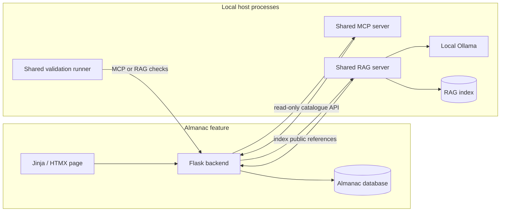
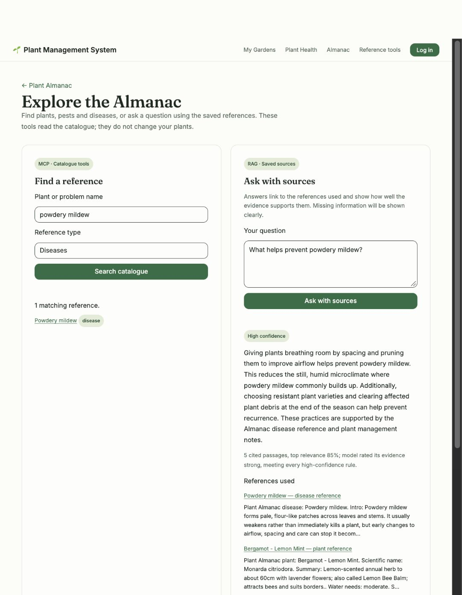
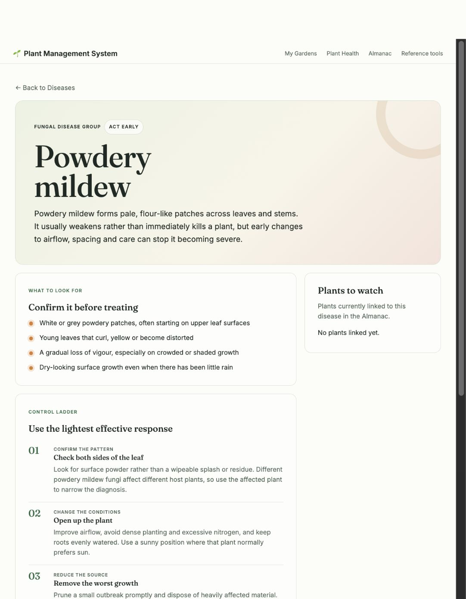

# Amy — Plant Almanac, Release 1

This follow-up is on `amy/almanac-release1`, based on Bageutter's shared RAG
confidence PR #59. It reuses Amy's existing plant, pest and disease pages from
PR #38. It does not merge or change another student's PR. Original imported
commits retain their author dates; new commits record when this work was done.

## Scope and flow

The Almanac keeps its plant catalogue, growing details, reference pages, database
and existing AI chat. **Reference tools** adds two small features:

- MCP searches plants, pests and diseases through the shared server. The server
  can also read one plant's growing details and associated problems.
- RAG answers questions using the Almanac's saved reference records, with links
  to the sources, a confidence category and an explanation. If the shared server
  cannot find relevant information, the page says so instead of showing an answer.



Only public reference data is indexed. Account history and private chat are not
included. Tools use fixed URLs and bounded input; callers cannot pick another
service or modify records. Refreshing the index from the page requires the existing
login and CSRF token. A failed refresh keeps the previous index.

## Run and demonstrate

Use Python 3.12 and the existing group application. Install the feature and shared
server requirements in a local environment:

```sh
python -m pip install -r almanac/requirements-dev.txt -r ai-services/mcp-server/requirements-dev.txt -r ai-services/rag-server/requirements-dev.txt
```

Start the shared servers in separate terminals. Do not start the old standalone
Almanac MCP adapter; these changes use the group's single shared server.

```sh
python ai-services/mcp-server/server.py
RAG_EMBED_MODEL='' OLLAMA_AUTO_PULL=false python ai-services/rag-server/app.py
```

The RAG command uses lexical retrieval with the installed local
`qwen3:4b-instruct` model. Embeddings are optional. With the group proxy on port
3000, the defaults find the Almanac at `http://127.0.0.1:3000/almanac`.

```sh
curl -X POST http://127.0.0.1:5106/rag/ingest/almanac
python tools/ai-loop/validate.py --mode mcp --output evidence/mcp.json
python tools/ai-loop/validate.py --mode rag --output evidence/rag.json
```

Open `/almanac/integrations` through the group proxy. Search for **powdery mildew**
under **Diseases**, then ask **What helps prevent powdery mildew?**. Follow the
disease reference link. Ask **Who won the 1986 FIFA World Cup?** to show the
insufficient-context case. The two terminal modes log Plan, Act, Observe and Adapt,
retry temporary connection failures at most once, and exit unsuccessfully for a
failed check. The original Release 0 loop remains available.

For containers, Almanac now reaches Ollama, MCP and RAG through
`host.docker.internal`. On Linux, a loopback-only host listener may not be reachable
from containers; use a host interface reachable by Docker with local firewall
restrictions. Do not expose these unauthenticated development servers publicly.

## Recorded validation — 30 September 2026

| Check | Actual result |
| --- | --- |
| Almanac regression suite | 61 passed, including database/API, existing AI chat, catalogue and integration cases |
| Shared MCP suite | 29 passed |
| Shared RAG suite | 49 passed; 11 Almanac cases rechecked after simplification |
| Ruff and Compose syntax | Passed |
| Live MCP through backend | Plant and disease searches passed; structured records returned |
| Live RAG through backend | 37 public records indexed; local `qwen3:4b-instruct` answer with source links and confidence; unrelated question refused |
| Browser | Disease search, sourced answer, refusal and disease-link navigation verified; screenshot below |
| Local Docker build | Initially blocked by full storage; resolved in the 1 October follow-up below |

Live checks used a separate native Almanac on `127.0.0.1:15004`, MCP on `15105`,
and RAG on `15106`, with a new database seeded from the public My Garden catalogue.
They did not change the running group application's database. These original
files record the native flow; the separate follow-up records the Docker run.

Evidence: [MCP JSON](evidence/amy-release1/mcp-live.json),
[RAG JSON](evidence/amy-release1/rag-live.json). The JSON identifies the model,
retrieval mode, returned citations and actual validation result.



### Docker follow-up — 1 October 2026

The local Docker disk was increased from 20 GB to 60 GB without deleting volumes.
All five application images rebuilt successfully and all seven Compose containers
started. The app runs from the normal `Plant-Management-System` checkout on
`amy/almanac-release1`.

The existing local catalogue held eight plants and no pest or disease records.
After a SQLite backup, the three missing public references were added without
replacing existing records. The shared RAG server indexed these 11 local records.
Both validation modes then passed through `http://localhost:3000/almanac`:
MCP returned plant and disease results, RAG answered with a disease citation and
confidence explanation, and the unrelated question was refused. Ollama, MCP and
RAG remained local host processes; the container reached them through
`host.docker.internal` while their listeners stayed on loopback.

The browser confirmed the disease guide no longer shows the requested Sources
card. AI answer citations are still shown. All 61 Almanac tests passed again with
MCP and RAG disabled.

Evidence: [Docker MCP JSON](evidence/amy-release1/mcp-docker.json),
[Docker RAG JSON](evidence/amy-release1/rag-docker.json),
[MCP transcript](evidence/amy-release1/mcp-docker-transcript.md),
[RAG transcript](evidence/amy-release1/rag-docker-transcript.md).



Amy's existing assigned workflow is `.github/workflows/plant_almanac.yml` (see
`.github/README.md`), now labelled **Plant Almanac (Amy)**. It runs on Amy branches
and relevant PRs, runs tests, and builds the image with MCP and RAG disabled. The
brief's `student-x.yml` wording should be mapped to this existing group convention
in the report. A GitHub run must be cited separately from local test results.

## Contribution log

| Commit | Contribution |
| --- | --- |
| `3da1166`, `aa2ae21`, `a5290e7` | Reused existing Amy PR #38 work: plant-linked pest/disease pages and growing-details naming |
| `ed6504a` | Public, read-only catalogue feed for shared services |
| `a669abf` | Almanac reference ingestion and citations in shared RAG |
| `eb09c95` | Two working Almanac tools in shared MCP |
| `c4fb8df` | Frontend forms, backend connections, visible errors, citations and confidence |
| `3f5de7f` | Almanac host-service connection settings in Compose |
| `a062b00` | Shared local validation modes and Amy's CI configuration |
| `a05643c` | Removed the Sources card from pest and disease guides |

## Report paragraph to append — Amy only

My assigned feature is the Plant Almanac. For Release 1, it retains the existing
plant catalogue, growing details, pest and disease pages, database operations and
local AI chat. I connected the feature to the group's shared MCP and RAG servers
through the Almanac Flask backend. The Reference tools page supports a structured
catalogue lookup and questions answered from saved reference material.

The shared MCP server exposes two read-only Almanac tools: catalogue search and
plant detail. Inputs are limited and validated, and tools read the public backend
API instead of accessing the database directly. The shared RAG server indexes
plants, pests and disease guides from that same API. It keeps a source link for
each entry and includes limitations such as missing guidance. The UI displays the
answer, source links, confidence category and confidence explanation. When no
relevant context is found, it displays an insufficient-context response.

Native and Docker end-to-end validation returned valid MCP plant and disease results and a
RAG answer about powdery mildew using the local model. An unrelated football
question was refused. The shared validation runner records Plan, Act, Observe and
Adapt in separate MCP and RAG modes. Automated tests cover existing Almanac
behaviour and the new service boundaries. My workflow keeps external MCP and RAG
calls disabled during CI while retaining the integrations in the application.

The full Docker disk was expanded and the local rebuild and Almanac integration
checks passed. The inherited group Compose file still defines Ollama as
a container for other features, although Almanac now uses host Ollama. Removing
that group-level mismatch with the non-containerised AI requirement, finishing
Virtual Garden's shared adapters, confirming the workflow-name convention and
recording the group showcase remain group responsibilities. This section is
Amy's contribution and is not a claim that the entire group submission is ready.
