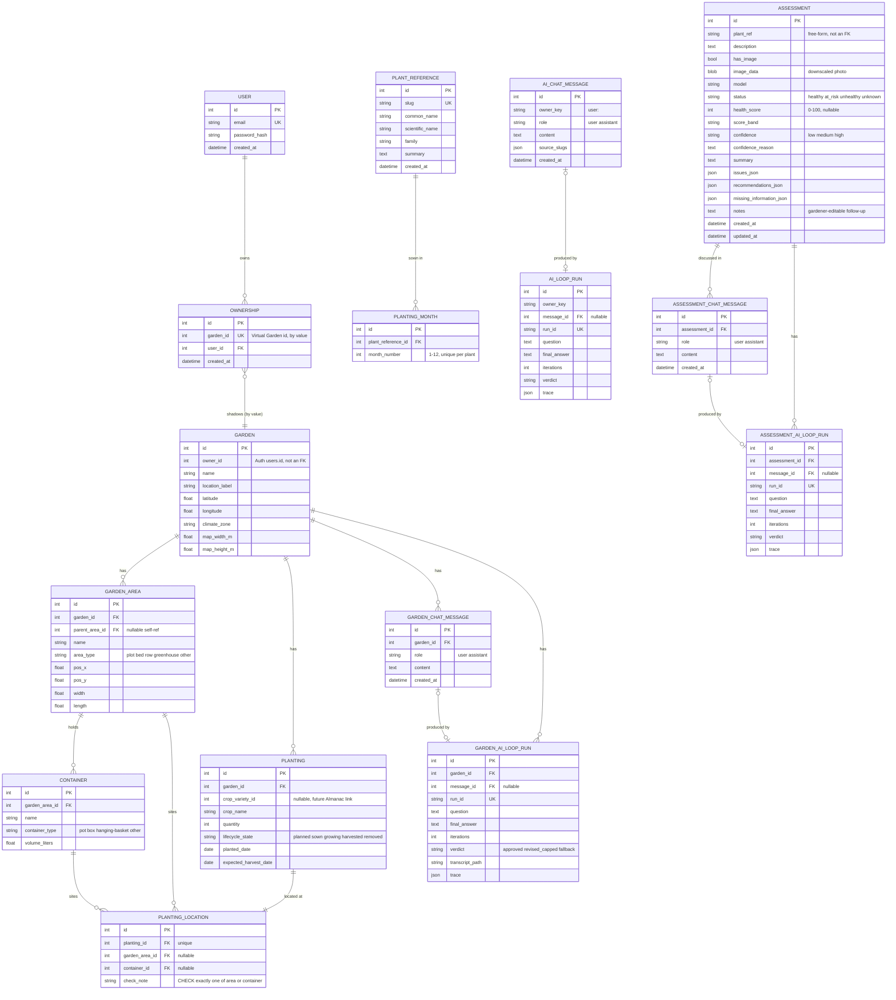
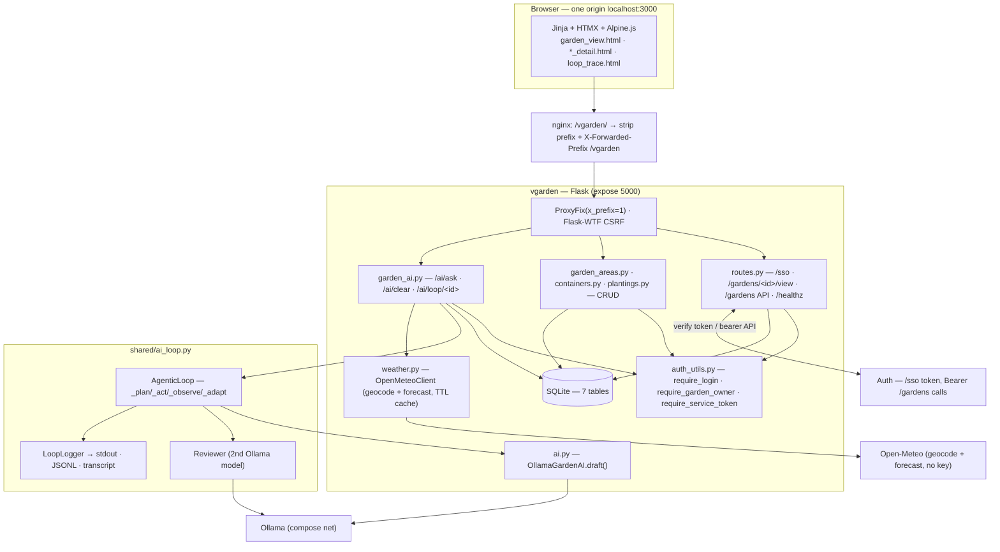
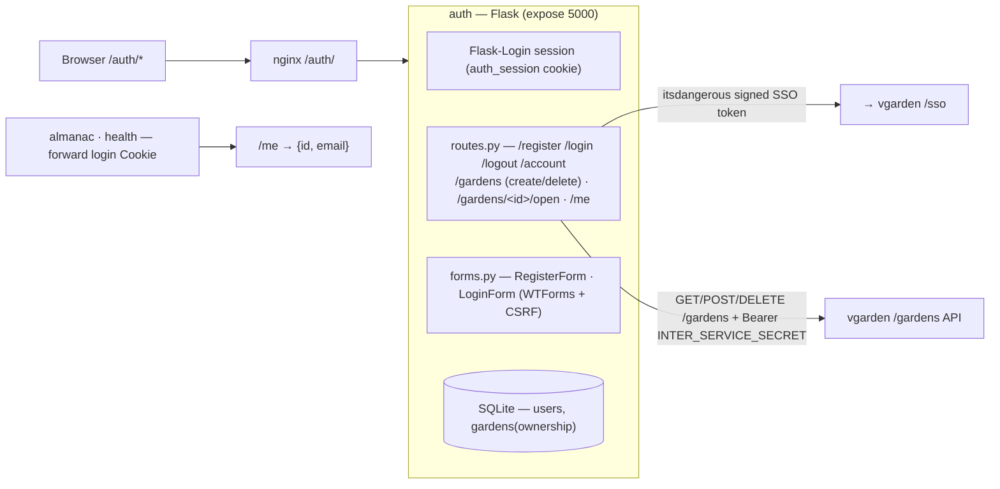
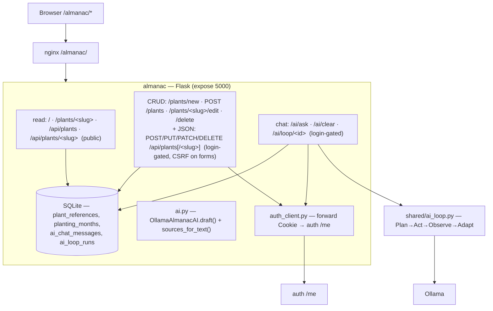
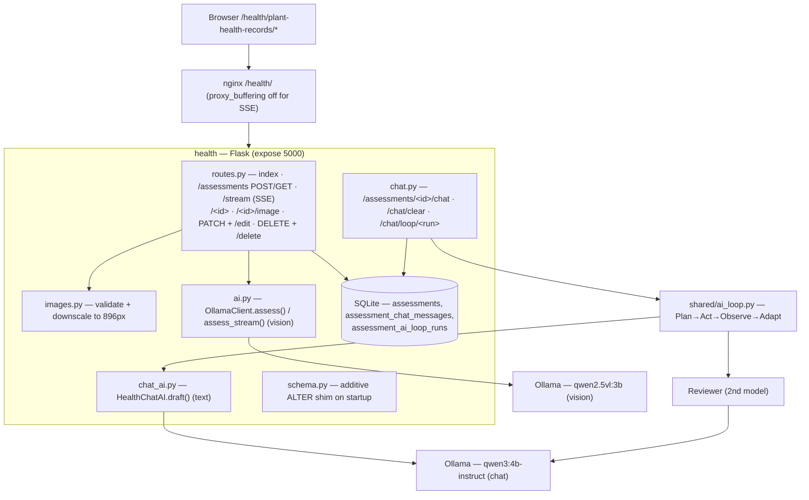
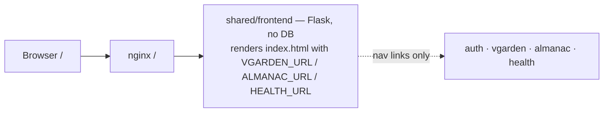
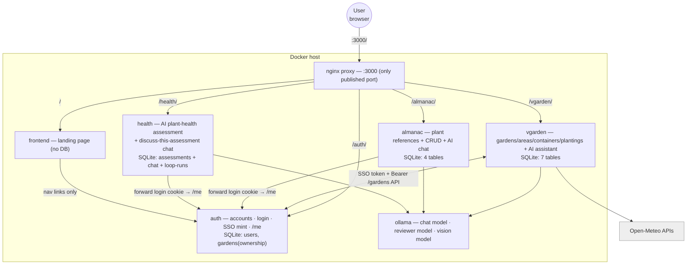
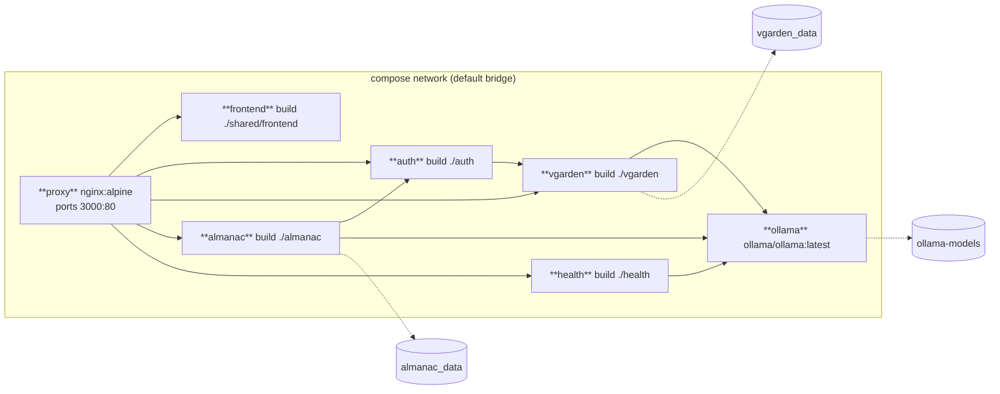
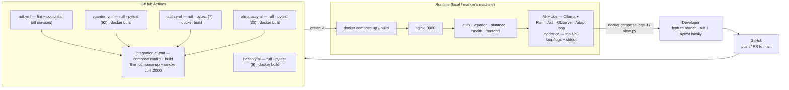
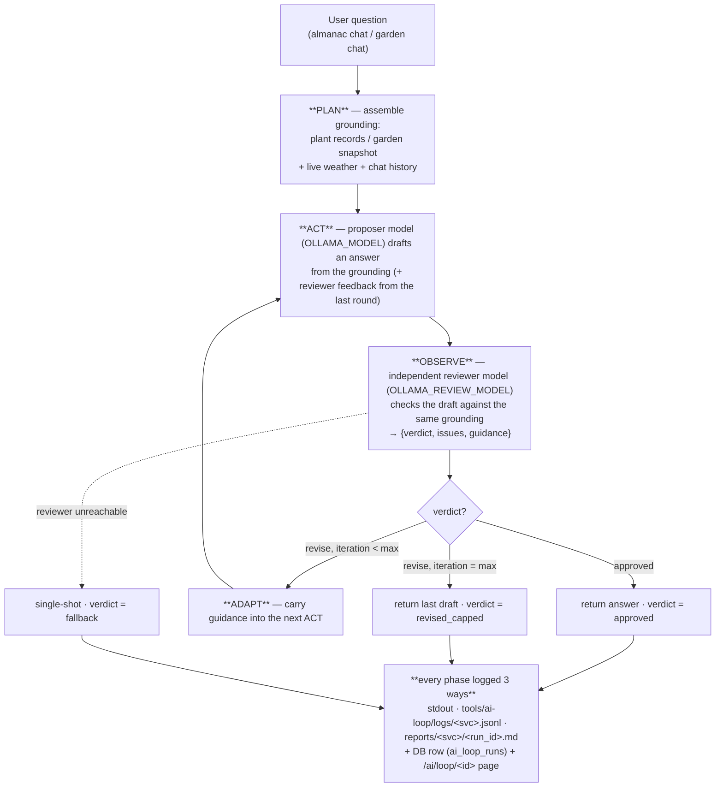

# Plant Management System — Release 0 Report

**Repository:** `Bageutter/Plant-Management-System`
**Report author:** Yunz (`yunz-dev`) — Virtual Garden Service
**Report date:** 2026-09-03

The Plant Management System is a Flask / HTMX / Alpine.js micro‑service system with a
locally‑hosted AI mode. This report covers **all Release 0 services**; the sections
that call for *individual* work go deepest on the **Virtual Garden** (my service).
`> **To confirm with the team**` callouts mark details another member owns.

**Contents**

1. Project Overview
2. Project Analysis and Planning (Agile)
3. Repository Structure
4. Individual Software Architecture (per service)
5. Integrated Software Architecture (Release 0)
6. Docker Compose Architecture
7. DevOps Pipeline Architecture
8. Agentic AI Workflow (Plan → Act → Observe → Adapt)
9. GitHub Actions Workflows
10. Implementation Summary
11. GitHub Actions Evidence
12. Docker Compose Evidence
13. Agentic Loop Workflow Record
14. Known Issues and Limitations

---

## 1. Project Overview

Each service owns its own SQLite database and renders its own Jinja UI. A single
**nginx reverse proxy** presents all of them as one site on port **`3000`**
(`/`, `/auth/`, `/vgarden/`, `/almanac/`, `/health/`). A locally‑hosted **Ollama**
model powers the "AI‑Mode" features, and every conversational AI answer runs through
a **Plan → Act → Observe → Adapt** agentic loop with a full evidence trail.

### 1.1 Team members and feature allocation

| Member (git identity) | Owns | Evidence |
|---|---|---|
| **Yunz** (`yunz-dev`) | **Virtual Garden** service; the shared **agentic loop** (`shared/ai_loop.py`, `tools/ai-loop/`); the single‑origin **nginx proxy** (`nginx.conf`, from `origin/ROUTING`); the **SSO handoff** into Auth; live weather for the garden assistant; Almanac CRUD | `yunz/virtual-garden`, `yunz/ai-agentic-loop`, `yunz/cicd` |
| **Amy Zhou** (`0melette`) | **Plant Almanac** service; the shared **navigation / header** (`shared/templates/_header.html`); the build‑time **AI reviewer** tool (`tools/ai-dev/`) | `amy/plant-almanac`, `amy/ai-dev`, `amy/nav-bar`, `amy/ci_cd_setup` |
| **Guhan Sundar** (`Bageutter`) | **Plant Health Monitoring** service; the marketing **landing page** (`shared/frontend/`) | `bageutter/introduce-health-monitoring-service`, `fe/landing` |
| **Auth** (shared foundation) | Accounts, login, session, `/me`, the SSO token mint, the ownership shadow table. Built collaboratively — Amy scaffolded the service and shared header; Yunz added the SSO token + bearer‑token API auth. | `origin/auth`, `origin/project-setup` |

> **To confirm with the team:** the brief references `student-1.yml … student-5.yml`
> (five students). The repository at Release 0 contains three feature services
> (Virtual Garden, Plant Almanac, Plant Health) plus the shared Auth and Frontend.
> A 4th/5th student's allocation is not determinable from git.

### 1.2 The services at a glance

| Service | Path | Purpose | AI mode | DB tables |
|---|---|---|---|---|
| **frontend** | `/` | Marketing landing page; links into the other services | — | none |
| **auth** | `/auth/` | Register / log in; account page listing the user's gardens; mints the SSO token; `/me` identity API | — | `users`, `gardens` (ownership) |
| **vgarden** | `/vgarden/` | The digital model of a garden — areas, containers, plantings (full CRUD, table view); "Ask about this garden" assistant | grounded chat + **Plan → Act → Observe → Adapt** loop + live weather | 7 (see §2.4) |
| **almanac** | `/almanac/` | Plant reference data (name, family, summary, planting months); public read + login‑gated **CRUD**; "Ask the Almanac" chat | grounded chat + **Plan → Act → Observe → Adapt** loop | `plant_references`, `planting_months`, `ai_chat_messages`, `ai_loop_runs` |
| **health** | `/health/plant-health-records/` | Assess a plant from a photo and/or description → health status, 0–100 score, confidence, issues, recommendations; **"discuss this assessment"** follow-up chat | vision model, streamed (SSE) structured output **for the assessment**; the follow-up chat runs the **Plan → Act → Observe → Adapt** loop | `assessments`, `assessment_chat_messages`, `assessment_ai_loop_runs` |
| **ollama** | (internal) | Local model server: chat model, reviewer model, vision model | — | — |

---

## 2. Project Analysis and Planning (Agile)

Agile method: short branch‑per‑feature sprints, each ending in a PR into `main`
gated by CI. Each member maintains their own backlog, feature plan and risk plan
below; the shared items (proxy, agentic loop, cross‑service auth) are tracked in the
overall project plan (§2.6).

### 2.1 Requirements matrix (all three feature services)

| # | Virtual Garden (Yunz) | Plant Almanac (Amy) | Plant Health (Guhan) |
|---|---|---|---|
| Core functional | model a garden (areas / containers / plantings) with full CRUD; grounded per‑garden AI assistant | plant reference data with public read + login CRUD; grounded "Ask the Almanac" chat | assess a plant from a photo and/or text; structured health verdict + advice |
| Data owned | 7 tables (`gardens` … `garden_ai_loop_runs`) | `plant_references`, `planting_months`, `ai_chat_messages`, `ai_loop_runs` | `assessments` (incl. the photo BLOB) |
| AI mode | conversational **Plan → Act → Observe → Adapt** loop + live weather | conversational, same loop | streamed vision call **for the assessment**; the follow‑up "discuss this assessment" chat runs the same loop |
| Auth model | own session started by an SSO token from Auth; API by bearer secret | forwards the login cookie to Auth `/me` | forwards the login cookie to Auth `/me` (nav only) |
| Key NFRs | service isolation, CSRF, proxy‑prefix safe, auditable AI | grounded/read‑only AI, CSRF on writes, public reads | local‑only inference, upload limits, honest confidence, latency vs VRAM |
| CI | `vgarden.yml` (92 tests) | `almanac.yml` (30 tests) — legacy `plant_almanac.yml` placeholder also present | `health.yml` (9 tests) |
| Seed data | 12 gardens; garden 1 fully populated (12/12/15/15) | 16 plants (93 planting‑month rows) | 12 assessments |

> The Plant Almanac and Plant Health plans below are **reconstructed from the code
> and commit history** and should be confirmed / edited by their owners.

---

### 2.2 Virtual Garden — Yunz

**Functional requirements**

| ID | As a … I want to … | Release 0 |
|---|---|---|
| VG‑F1 | garden owner, create a garden with a name and location | ✅ `auth` → `POST /gardens`, geocoded by vgarden |
| VG‑F2 | garden owner, open only my own gardens | ✅ SSO token + `require_garden_owner` (404 for non‑owners) |
| VG‑F3 | garden owner, add / edit / delete garden **areas** | ✅ `garden_areas.py` |
| VG‑F4 | garden owner, add / edit / delete **containers** in an area | ✅ `containers.py` |
| VG‑F5 | garden owner, add / edit / delete **plantings** located in an area or container | ✅ `plantings.py` |
| VG‑F6 | garden owner, see everything in one table view | ✅ `garden_view.html` |
| VG‑F7 | garden owner, ask an AI assistant about *this* garden and get a grounded answer | ✅ `garden_ai.py` + `shared/ai_loop.py` |
| VG‑F8 | garden owner, have the assistant use local weather for watering / frost questions | ✅ `weather.py` (Open‑Meteo) |
| VG‑F9 | garden owner, walk a 2D / 3D map of the garden | ⛔ Deferred — disabled placeholder tabs |
| VG‑F10 | garden owner, link a planting to a Plant Almanac entry | ⛔ Deferred — `crop_variety_id` column exists, nullable |

**Non‑functional requirements**

| ID | Requirement | How met |
|---|---|---|
| VG‑N1 | Service isolation — vgarden owns only garden data, never reads another service's DB | Own SQLite DB; identity arrives as a signed token |
| VG‑N2 | Authn/authz — browser routes require login; the `/gardens` API requires a shared bearer secret | `require_login` / `require_garden_owner` / `require_service_token` |
| VG‑N3 | CSRF on all state‑changing browser forms | Flask‑WTF `CSRFProtect`; the API is `@csrf.exempt` (token auth) |
| VG‑N4 | Runs behind a path‑prefixed reverse proxy | `ProxyFix(x_prefix=1)`; `/sso` uses `request.script_root` |
| VG‑N5 | Local‑only AI | Ollama on the compose network; Open‑Meteo is the only outbound call, no key |
| VG‑N6 | Resilience — a weather or reviewer outage must not break the chat | Both degrade gracefully and are logged |
| VG‑N7 | Every AI answer auditable | 3 log sinks + a DB row + an in‑app trace page per run |
| VG‑N8 | CI lints, tests and builds the image on every push/PR | `.github/workflows/vgarden.yml` (92 tests) |

**Individual feature plan**

| Stage | Scope | Commit |
|---|---|---|
| 1 | Port the "weather‑mcp" reference implementation onto `main`'s conventions: full schema, SSO handoff, ownership checks, table CRUD, CI | `52f28ee` |
| 2 | "Ask about this garden" assistant (grounded Ollama client + chat history + HTMX partial) | `a7b77c2` |
| 3 | Merge `ROUTING`: single nginx origin on `:3000`, `ProxyFix` in every service, distinct session‑cookie names | `5a46197` |
| 4 | Live weather in the assistant (Open‑Meteo geocode + forecast); fix the silent HTMX/Ollama failure | `fc5d06e` |
| 5 | Shared **Plan → Act → Observe → Adapt** loop wrapping both AI chats + evidence logging + `view.py` | `32694f1`, `15829a5`, `cb64661` |
| 6 | Plant Almanac **CRUD** (contribution to Amy's service) + visible month toggles | `3520688`, `03e42d8` |

**Risk management plan**

| Risk | L | I | Mitigation | Residual |
|---|---|---|---|---|
| `main` diverged far from the reference branch → large re‑integration | H | H | Ported file‑by‑file, kept `main`'s shared header + service list, rebased to a fast‑forward | Low |
| Local Ollama model not present on the marker's machine | H | H | `OLLAMA_AUTO_PULL=true`; the loop degrades to single‑shot if it can't pull | Low |
| CPU inference latency (2 × draft + review ≈ 1–3 min) | H | M | `AI_LOOP_MAX_ITERATIONS=2`, capped `num_predict`, a "Planning · drafting · reviewing…" indicator | Med (inherent) |
| Proxy sub‑path routing breaks intra‑service redirects & the SSO `next` path | M | H | `X‑Forwarded‑Prefix` + `ProxyFix`; `/sso` prepends `request.script_root` | Low |
| Session‑cookie collision once Auth + vgarden share one origin | M | M | `SESSION_COOKIE_NAME = auth_session / vgarden_session` | Low |
| Open‑Meteo unavailable / geocode miss | L | L | `WeatherUnavailableError` caught; raw label kept; `weather: null` in the AI context | Low |
| Reviewer model over‑flags faithful drafts → needless loops | M | L | Pretty‑print grounding to the reviewer; prompt states "restating grounding is correct"; model configurable | Low |
| CSRF gap on the new Almanac forms | M | M | Added Flask‑WTF to Almanac; browser mutations now carry a token | Low |

---

### 2.3 Plant Almanac — Amy Zhou

*(reconstructed from `almanac/` and the `amy/*` branch history — to be confirmed by Amy)*

**Functional requirements**

| ID | As a … I want to … | Release 0 |
|---|---|---|
| AL‑F1 | visitor, browse plant reference cards and open a detail page (name, family, summary, planting months) | ✅ public — `/`, `/plants/<slug>` |
| AL‑F2 | other service, read plant data as JSON | ✅ public — `/api/plants`, `/api/plants/<slug>` |
| AL‑F3 | logged‑in user, add a plant reference with its planting months | ✅ `GET /plants/new`, `POST /plants` (+ `POST /api/plants`) |
| AL‑F4 | logged‑in user, edit a plant reference; the URL slug stays stable | ✅ `GET/POST /plants/<slug>/edit` (+ `PUT/PATCH /api/plants/<slug>`) |
| AL‑F5 | logged‑in user, delete a plant reference and its months | ✅ `POST /plants/<slug>/delete` (+ `DELETE /api/plants/<slug>`) |
| AL‑F6 | logged‑in user, ask a natural‑language question and get an answer grounded only in the stored plants | ✅ "Ask the Almanac" floating chat, `POST /ai/ask` |
| AL‑F7 | user, keep a per‑account chat history and clear it | ✅ `ai_chat_messages` keyed by `user:<auth id>`, `POST /ai/clear` |
| AL‑F8 | user, see which plant records an answer used | ✅ "Sources" links (derived from the answer text) |
| AL‑F9 | user, know that the answer was reviewed / iterated | ✅ `Plan → Act → Observe → Adapt` badge + `/ai/loop/<id>` trace page |
| AL‑F10 | maintainer, seed a starter set of plants on first run | ✅ `seed_data.py` (16 plants), seeded only when the table is empty |

**Non‑functional requirements**

| ID | Requirement | How met |
|---|---|---|
| AL‑N1 | Reads are public; writes require an Auth login | forwards the browser cookie to Auth `/me`; `_login_or_redirect()` / `_api_user_or_401()` |
| AL‑N2 | The AI is **read‑only** over plant data and **grounded** — never invents care/climate/planting facts | `SYSTEM_PROMPT`: answer only from supplied records, else *"I don't have enough information …"* |
| AL‑N3 | CSRF on browser mutations | Flask‑WTF `CSRFProtect` (added with CRUD); JSON write API is `@csrf.exempt` |
| AL‑N4 | Local‑only AI | Ollama on the compose network; nothing leaves the network |
| AL‑N5 | Slugs are URL identity — stable across edits, unique on create | `_slugify` + `_unique_slug` with a `-N` collision suffix |
| AL‑N6 | Data integrity on month edits | planting months are **diffed**, not replaced (avoids a unique‑constraint clash mid‑flush) |
| AL‑N7 | Tests must not need Ollama or a real login | fake Auth + fake AI clients in `tests/` |
| AL‑N8 | Runs behind the path‑prefixed proxy | `ProxyFix(x_prefix=1)` |

**Individual feature plan** (from commit history)

| Stage | Scope | When / branch |
|---|---|---|
| 1 | Basic Plant Almanac service — Flask app factory, `PlantReference` / `PlantingMonth` models, Docker support, initial seed data | 2026‑08‑28 (`amy/plant-almanac`) |
| 2 | UI for the plant list + detail pages; fix the slug query and prevent duplicate seeding | 2026‑08‑31 |
| 3 | "Add an AI question" feature with example prompts | 2026‑09‑01 |
| 4 | Authenticated AI **chat** with saved per‑user history (`auth_client.py` → Auth `/me`) | 2026‑09‑01 |
| 5 | Adopt the shared navigation / header | 2026‑09‑01 |
| 6 | *(contributed by Yunz)* CRUD for plant references; migrate the AI answer onto the shared **Plan → Act → Observe → Adapt** loop | 2026‑09‑03 |
| — | *cross‑cutting:* the build‑time **AI reviewer** tool (`tools/ai-dev/`), CI setup (`amy/ci_cd_setup`), shared `_header.html` (`amy/nav-bar`) | 2026‑08/09 |

**Risk management plan**

| Risk | L | I | Mitigation | Residual |
|---|---|---|---|---|
| AI hallucinates care/planting facts not in the records | H | H | Strict grounded `SYSTEM_PROMPT`; "I don't have enough information" fallback; answer‑derived source links let the user verify | Med |
| Duplicate seed data on repeated startup | M | M | Seed only when `PlantReference.query.first()` is `None`; slug uniqueness enforced (fixed 2026‑08‑31) | Low |
| Ollama unavailable / model missing → chat unusable | H | M | `ensure_model` + `OLLAMA_AUTO_PULL`; the loop degrades to single‑shot and the error partial now renders (HTMX config fix) | Low |
| No admin role — any logged‑in user can delete reference data | M | M | Accepted for Release 0; documented in Known Issues; a `role` column on `users` is the Release 1 fix | **Open** |
| Cross‑service auth coupling (needs Auth's `/me`) | M | M | Cookie forwarded, never a DB read; graceful "session expired" partial on 401 | Low |
| CSRF on state‑changing forms | M | M | Flask‑WTF added; the AI chat/clear forms also carry a token | Low |
| Chat history grows unbounded | L | L | `CHAT_HISTORY_LIMIT = 20` on what is sent to the model; `Clear chat` button | Low |

---

### 2.4 Plant Health Monitoring — Guhan Sundar

*(reconstructed from `health/`, `health/README.md` and the `bageutter/*` history — to be confirmed by Guhan)*

**Functional requirements**

| ID | As a … I want to … | Release 0 |
|---|---|---|
| HL‑F1 | gardener, submit a **photo**, a **text description**, or **both**, and get a health assessment | ✅ `POST /assessments` |
| HL‑F2 | gardener, watch the assessment **stream in** as the model writes it | ✅ `POST /assessments/stream` (Server‑Sent Events) |
| HL‑F3 | gardener, get a `status` (`healthy` / `at_risk` / `unhealthy` / `unknown`) and a 0–100 **health score** with a band label | ✅ strict JSON schema, normalised + clamped |
| HL‑F4 | gardener, get the model's **confidence** (low/medium/high) **and a reason** for it | ✅ `confidence` + required `confidence_reason` |
| HL‑F5 | gardener, get concrete **issues** and **recommendations** (least‑invasive first), plus **what else would help** | ✅ `issues`, `recommendations`, `missing_information` (≤ 4 each) |
| HL‑F6 | gardener, review a past assessment **beside the photo** it was based on | ✅ `/plant-health-records/<id>`, `/<id>/image` |
| HL‑F7 | gardener, browse recent assessments | ✅ index + `_record_list.html` |
| HL‑F8 | gardener, **edit** a record's plant name / description / follow‑up notes after the assessment | ✅ `POST /assessments/<id>/edit` (inline form) + `PATCH /assessments/<id>` (JSON) — the AI result stays immutable |
| HL‑F9 | gardener / other service, **delete** a record | ✅ `POST /assessments/<id>/delete` (form) + `DELETE /assessments/<id>` (JSON) |
| HL‑F10 | other service, list / fetch assessments as JSON | ✅ `GET /assessments`, `GET /assessments/<id>` |
| HL‑F11 | gardener, **ask follow‑up questions** about an assessment and get a grounded, reviewed answer | ✅ "Discuss this assessment" chat → `POST /assessments/<id>/chat` → **Plan → Act → Observe → Adapt** loop (`chat.py` + `chat_ai.py` + `shared/ai_loop.py`); history stored in `assessment_chat_messages`; per‑answer trace at `/assessments/<id>/chat/loop/<run_id>` |
| HL‑F12 | operator, have the models **pulled automatically** on first use; the DB seeded on a fresh start | ✅ `ensure_model` + `OLLAMA_AUTO_PULL=true`; `seed_data.py` (12 assessments + 20 chat messages + 10 loop runs) |

**Non‑functional requirements**

| ID | Requirement | How met |
|---|---|---|
| HL‑N1 | **All inference local** — no image or description leaves the network | Ollama only; documented scope note |
| HL‑N2 | Bounded uploads | `MAX_CONTENT_LENGTH` 12 MB; `ALLOWED_IMAGE_TYPES` = jpeg/png/webp/gif; 413 handler |
| HL‑N3 | Bounded inference cost | photos downscaled to `IMAGE_MAX_EDGE` 896 px; `OLLAMA_NUM_PREDICT` 700; prompt caps 4 issues / 4 recs |
| HL‑N4 | Acceptable latency | `OLLAMA_KEEP_ALIVE=30m` keeps the model resident (≈ 4 s warm vs ≈ 16 s cold); GPU override available |
| HL‑N5 | **Honest confidence** — never present a fabricated numeric probability | numeric confidence removed; graded low/medium/high with a mandatory justification; UI tooltip says "self‑assessment, not a calibrated probability" |
| HL‑N6 | **Evidence grounding** — the model is told exactly what it was given | `EVIDENCE PROVIDED: …` line; `confidence_reason` must be consistent with it |
| HL‑N7 | Additive schema evolution without a migration tool | `schema.py` issues `ALTER TABLE … ADD COLUMN` for missing nullable columns on startup ([issue #10](https://github.com/Bageutter/Plant-Management-System/issues/10)) |
| HL‑N8 | Runs behind the proxy; SSE must not be buffered | `ProxyFix`; nginx `proxy_buffering off` for `/health/` |

**Individual feature plan** (from commit history + README)

| Stage | Scope | When |
|---|---|---|
| 1 | Initial Health Monitoring service — Flask app, `Assessment` model, Ollama client, upload + assess flow | 2026‑08‑28 |
| 2 | Model‑selection experiment — benchmark `gemma4` / `gemma3:4b` / `qwen2.5vl:3b` / `moondream` for speed and JSON reliability; pick `qwen2.5vl:3b` | 2026‑08 (README perf table) |
| 3 | Address review feedback; fix a DB‑version problem; lint fixes; add the `schema.py` ALTER shim | 2026‑08‑31 → 09‑01 |
| 4 | SSE streaming assessment; score bands + tooltip; redesign confidence from numeric → graded + reason | 2026‑08/09 |
| 5 | Merge to `main` as PR **#9** ("Introduce Health Monitoring Service") | 2026‑09‑01 |
| — | *(platform, contributed by Yunz):* `ProxyFix` + nginx `/health/` routing with `proxy_buffering off` | 2026‑09‑02 |

**Risk management plan**

| Risk | L | I | Mitigation | Residual |
|---|---|---|---|---|
| Model larger than available VRAM → spills to CPU, 4–5× slower | H | H | Default `qwen2.5vl:3b` (3 GB) fits an 8 GB GPU; README documents the trade‑off; GPU compose override | Med |
| Cold‑start model reload on every request (7–40 s) | H | M | `OLLAMA_KEEP_ALIVE=30m` keeps it resident | Low |
| Vision model returns unusable JSON (e.g. `moondream` on text‑only) | M | H | Chose a model that produced valid structured output in every benchmark case; strict schema + `parse_content` normalisation; `AIUnavailableError` on failure | Low |
| Self‑reported numeric confidence is inflated / meaningless | H | M | Removed numeric confidence; graded low/medium/high + mandatory `confidence_reason` + honest UI tooltip | Low |
| Large phone photos blow the token budget / time out | M | M | Downscale to 896 px before inference; 12 MB upload cap; `OLLAMA_TIMEOUT=180` | Low |
| DB created by an older version is missing columns | M | H | `schema.py` adds missing nullable columns on startup (stop‑gap; Alembic is the real fix) | Med — additive only |
| CRUD requires an Update path; assessments are AI‑generated | M | M | Added `PATCH /assessments/<id>` + an edit form for the gardener‑editable fields (plant name / description / notes); the AI result stays immutable | Low |
| No automated tests / real CI for the service | M | M | Added `health/tests/` (9 tests, fake AI client) + a real `health.yml` (lint · test · docker build) | Low |
| Not integrated with Virtual Garden / Almanac | L | L | Deliberate for Release 0 — `plant_ref` is a free‑form string, never resolved | Accepted |

### 2.5 Data design

**Conceptual (whole system).** A `User` (Auth) owns `Garden`s. A `Garden` contains
`Area`s; an `Area` holds `Container`s; a `Planting` lives at exactly one `Location`
(an `Area` **or** a `Container`). A `Garden` also has a `Chat` of `Message`s, each
assistant `Message` backed by one `LoopRun` (its agentic‑loop trace). The `Almanac`
holds `PlantReference`s each with a set of `PlantingMonth`s, plus its own `Chat` /
`LoopRun`s. `Health` holds independent `Assessment`s that reference a plant only by a
free‑form string. Cross‑service links are by **value**, never by a database foreign
key — each service owns its own data.

**Logical / physical ERD** (SQLite; `db.create_all()` — additive `ALTER` shim in
`health/schema.py`; no migration tool at Release 0):



### 2.6 Contribution to the overall project plan

- Proposed and implemented the **single‑origin nginx proxy** — adopted repo‑wide.
- Proposed and implemented the **shared agentic loop** and its evidence tooling — now
  used by the Almanac, Virtual Garden **and Plant Health** chats.
- Defined the **cross‑service auth pattern** (short‑lived signed SSO token + shared
  bearer secret) reused wherever one service must call into another's browser pages.
- Brought all three feature services to **showcase readiness**: >= 10 seed rows per
  table, complete CRUD (adding Almanac CRUD and Health's update path + follow‑up
  chat), and a unified home page linking every feature.

---

## 3. Repository Structure

```
Plant-Management-System/
├── docker-compose.yml            # proxy, frontend, auth, vgarden, almanac, health, ollama
├── docker-compose.gpu.yml        # optional NVIDIA override for ollama
├── nginx.conf                    # single-origin reverse proxy (:3000, path-routed)
├── pyproject.toml                # shared ruff config
├── README.md · report.md
│
├── auth/       app.py routes.py forms.py models.py extensions.py config.py + templates/ tests/
├── vgarden/    app.py routes.py garden_areas.py containers.py plantings.py garden_ai.py
│               models.py auth_utils.py form_helpers.py weather.py ai.py + templates/ tests/
├── almanac/    app.py ai.py auth_client.py models.py seed_data.py + templates/ tests/
├── health/     app.py routes.py ai.py images.py schema.py models.py + templates/
├── shared/
│   ├── frontend/                 # marketing landing page (Flask)
│   ├── templates/_header.html    # shared nav macro, ChoiceLoader'd into every service
│   └── ai_loop.py                # canonical Plan→Act→Observe→Adapt orchestrator
│
├── tools/
│   ├── ai-dev/                   # build-time reviewer (Amy): pipeline.py, prompts/, logs/reports/
│   └── ai-loop/                  # runtime loop evidence: view.py, README.md, logs/{jsonl, reports/}
│
├── docs/agentic-ai-workflow.md
└── .github/workflows/            # vgarden.yml auth.yml almanac.yml health.yml
                                  # plant_almanac.yml ruff.yml integration-ci.yml
```

Every service directory is self‑contained (own `Dockerfile`, `requirements.txt`,
`extensions.py`, `app.py`, `tests/`, `conftest.py`). The repo deliberately copies
service scaffolding rather than sharing a Python package — only `shared/templates/`,
`shared/ai_loop.py` and the proxy config are shared.

---

## 4. Individual Software Architecture (per service)

Each service is a Flask app factory; each renders its own frontend (Jinja + HTMX +
Alpine.js — no SPA, no build step); each owns one SQLite database; each sits behind
the proxy with `ProxyFix`.

### 4.1 Virtual Garden (my service — full detail)



- **Frontend:** table view of areas/containers/plantings with Alpine modal forms; the
  floating "Ask about this garden" chat swaps an HTMX partial; a per‑answer
  `Plan → Act → Observe → Adapt` badge links to a full trace page.
- **Backend/API:** 5 blueprints, 23 routes. Browser routes session‑gated; the
  machine‑to‑machine `/gardens` API bearer‑token‑gated + CSRF‑exempt.
- **Database:** one SQLite file (`vgarden_data` volume), 7 tables.

### 4.2 Auth



Backend: password hashing (`werkzeug`), `flask_login` sessions, `itsdangerous`
`URLSafeTimedSerializer` for the 60‑second SSO token. Database: `users`
(`email` unique, `password_hash`), `gardens` (an ownership shadow row —
`garden_id` unique, `user_id` FK; the garden's real data lives in vgarden).

### 4.3 Plant Almanac



Frontend: public plant cards + detail pages; a login‑gated `plant_form.html` with
pill‑toggle month selectors; the same floating chat panel as vgarden. Backend: reads
public, writes require an Auth session (forwarded cookie → `/me`); slugs auto‑generate
with a `-N` collision suffix and are stable across edits; planting months are diffed,
not replaced. Database: 4 tables.

### 4.4 Plant Health Monitoring



Frontend: an upload form (photo and/or description) that streams the assessment in
live via Server‑Sent Events; a history list; a detail page showing the assessment
beside the photo it was based on, with an inline **edit** form and a floating
**"Discuss this assessment"** chat. Backend: the assessment is one vision‑model
call producing a strict JSON schema (`status`, `health_score` + band, `confidence`
+ reason, `issues`, `recommendations`, `missing_information`), normalised and
clamped; the follow‑up chat runs the shared agentic loop over an assessment
snapshot + conversation history. Database: `assessments` (incl. the downscaled
photo BLOB) + the two chat/loop tables.

### 4.5 Frontend (landing page)



A single static‑ish page (Jinja, no database) using the shared `_header.html` macro;
its only inputs are the browser‑facing URLs of the other services, injected as env.

---

## 5. Integrated Software Architecture — Release 0



| From | To | Mechanism |
|---|---|---|
| any service | Auth | forward the browser `Cookie` to `GET /auth/me` |
| Auth | vgarden | signed `itsdangerous` SSO token → `/vgarden/sso`; `Bearer INTER_SERVICE_SECRET` → `/vgarden/gardens` |
| vgarden / almanac / health | Ollama | `POST /api/chat` (+ `/api/tags`, `/api/pull`) on the compose network |
| vgarden | Open‑Meteo | public geocoding + forecast (no key) |
| all browser traffic | nginx | one origin, path‑routed, `X‑Forwarded‑*` |

Not yet integrated: Virtual Garden ↔ Almanac (crop link), Health ↔ Virtual Garden
(plant reference), a scheduler / notifications tier.

---

## 6. Docker Compose Architecture



| Aspect | Value |
|---|---|
| Published port | **`3000`** only (the `proxy`); every service is `expose`‑only |
| `depends_on` | `proxy` → all; `auth` → `vgarden`; `almanac` → `auth`, `ollama`; `vgarden`/`health` → `ollama` |
| Named volumes | `vgarden_data`, `almanac_data` (SQLite), `ollama-models` (model cache) |
| Key bind mounts | service source (live reload), `shared/templates`, `shared/ai_loop.py`, `tools/ai-loop/logs` |
| Secrets / config | `INTER_SERVICE_SECRET` (auth↔vgarden), `SECRET_KEY` per session‑using service, `OLLAMA_*`, `AI_LOOP_*` |
| GPU | `docker compose -f docker-compose.yml -f docker-compose.gpu.yml up` |

---

## 7. DevOps Pipeline Architecture



- **Branch‑scoped CI:** per‑service workflows trigger on `push` to a member's branch
  prefix (and any PR), filtered by path — a change to `vgarden/` only runs `vgarden.yml`.
- **Integration CI** validates and builds the whole Compose stack on every PR, brings
  it up, and smoke‑curls the proxy (`:3000/`, `/auth/login`, `/vgarden/healthz`, `/almanac/`).
- **AI‑Mode** is exercised at **runtime** (models are not pulled in CI); its evidence
  trail (JSONL + transcripts + stdout) is the audit mechanism.
- **Deployment:** Release 0 targets local `docker compose`; no cloud stage yet.

---

## 8. Agentic AI Workflow — Plan → Act → Observe → Adapt



Full write‑up: [`docs/agentic-ai-workflow.md`](docs/agentic-ai-workflow.md).
Orchestrator: [`shared/ai_loop.py`](shared/ai_loop.py). Terminal viewer:
`python tools/ai-loop/view.py`.

> Plant Health's **initial assessment** is a single streamed vision‑model call
> (structured JSON output), not the iterating loop. Its **follow‑up "discuss this
> assessment" chat** runs the full Plan → Act → Observe → Adapt loop, exactly like
> the almanac and virtual‑garden chats — so all three features exercise the loop.

---

## 9. GitHub Actions Workflows

The repository uses **descriptive** names rather than `student-N.yml`; the mapping is:

| Brief slot | Actual file | Owner | What it does |
|---|---|---|---|
| student‑1 | `vgarden.yml` | Yunz | `push:["yunz/**"]` / any PR, paths `vgarden/**`, `shared/**`, `pyproject.toml`. Jobs: **lint** (`ruff check vgarden` + `compileall`), **test** (`pip install -r vgarden/requirements-dev.txt` → `pytest -q`, **92** tests), **docker‑build** (`docker build ./vgarden`). |
| student‑2 | `almanac.yml` | Yunz (Amy's service) | Same shape for `almanac/**` + `shared/**`; runs the **30** Almanac tests. Added so the Almanac chat + CRUD are covered on `yunz/**`. |
| student‑2 (legacy) | `plant_almanac.yml` | Amy | Placeholder (`echo placeholder`), scoped to `amy/**` + `paths:["almanac/**"]`. |
| student‑3 | `auth.yml` | Yunz | Lint + `pytest` (**7**) + `docker build ./auth`, for `auth/**`. |
| student‑4 | `health.yml` | Guhan / Yunz | Same shape for `health/**` + `shared/**`, on `bageutter/**` + `yunz/**` + any PR; runs the **15** Health tests. |
| student‑5 | — | — | Not present (see §1). |
| shared | `ruff.yml` | team | `push:[main]` / any PR — repo‑wide `ruff check` + `compileall auth shared vgarden almanac`. |
| shared | `integration-ci.yml` | team | `push:[main]` / any PR — `docker compose config --quiet` + `docker compose build`; then `docker compose up --detach` and smoke‑curl the proxy; uploads `compose.log`; tears down with `--volumes`. |

Every workflow: `permissions: contents: read`, a `concurrency` group with
`cancel-in-progress: true`, and `timeout-minutes` on each job.

---

## 10. Implementation Summary (Release 0)

**Automated tests: 144** — vgarden 92, almanac 30, auth 7, health 15 (all green;
ruff clean; `docker compose config` valid).

| Service | Done and tested | Deferred |
|---|---|---|
| **frontend** | landing page with the shared header; direct links to all three feature services; planned services clearly marked | real content / imagery |
| **auth** | register / login / logout; account page (garden list via bearer API); create + confirm‑delete garden; **SSO token mint**; `/me`; distinct `auth_session` cookie; **seeds a demo account** (`demo@plant.test` / `demogarden`) + 12 users + 12 ownership rows on a fresh DB | password reset, email verification, roles |
| **vgarden** | SSO landing + session; `require_garden_owner` (404 for strangers); **full CRUD** for gardens/areas/containers/plantings (table view, Alpine modals); location **geocoding** (Open‑Meteo); `/healthz`; the **agentic‑loop** garden assistant with **live weather**; per‑answer trace + `/ai/loop/<id>` page; **seeds 12 gardens + a fully‑populated garden 1** (12 areas / 12 containers / 15 plantings / 15 locations) | 2D/3D map; Almanac crop link |
| **almanac** | public plant reference pages + read JSON API; **full CRUD** (browser forms + JSON API, login‑gated, CSRF on browser mutations, visible month toggles); "Ask the Almanac" chat on the **agentic loop**; answer‑derived source links; **seeds 16 plants** (93 planting‑month rows) | rich reference data; per‑user favourites |
| **health** | photo/description → local **vision model** → structured assessment (status, 0–100 score + band, confidence + reason, issues, recommendations, missing‑info); **SSE streaming**; history + photo‑beside‑result detail; **full CRUD** — create (assess), read (list/detail/JSON), **update** (`PATCH /assessments/<id>` + edit form for plant name / description / notes), delete (API + form); **"discuss this assessment" chat** on the **agentic loop** with stored history + trace pages; `schema.py` ALTER shim; **15 tests**; **seeds 12 assessments + 20 chat messages + 10 loop runs**; `../shared/templates` loader fixed | link to a real plant record; CSRF on the edit/delete/chat forms |
| **platform** | single nginx origin on `:3000`; `ProxyFix` in every service; shared `ai_loop.py`; `tools/ai-loop/view.py`; `docs/agentic-ai-workflow.md`; per‑service CI (`vgarden` / `auth` / `almanac` / **`health`**) + integration CI | cloud deploy; migrations tool; role‑based access |

### 10.1 Release 0 showcase readiness checklist

Run **`docker compose down -v && docker compose up --build`** for a clean demo
dataset, then open **http://localhost:3000**. First AI question per service pulls
its model (`qwen3:4b-instruct` for chat, `qwen2.5vl:3b` for health).

| §2.3 / §2.4 requirement | Status | Evidence |
|---|---|---|
| One integrated Agentic AI application | ✅ | nginx proxy — all services under `http://localhost:3000` |
| All frontend / backend / DB microservices integrated | ✅ | `docker compose config` valid; `integration-ci.yml` builds + smoke‑checks the stack |
| **Every feature microservice interacts with the LLM at each showcase** | ✅ | Virtual Garden chat (loop) · Plant Almanac chat (loop) · Plant Health assessment (vision model) **+ its follow‑up chat (loop)** — all local Ollama |
| Shared GitHub repo with a common structure | ✅ | §3 |
| Shared Docker Compose to run everything | ✅ | `docker-compose.yml` (+ `docker-compose.gpu.yml`) |
| **Unified home page (`index.html`) links to all individual features** | ✅ | `shared/frontend` — nav + three linked service cards to Virtual Garden, Plant Almanac, Plant Health |
| Consistent CSS theme / UI across the app | ✅ | every service: Franken UI 2.0.0, `--primary: 142 42% 30%`, Fraunces + Inter, shared `_header.html` |
| Integrated + tested before release; integration issues resolved | ✅ | 144 tests green; branch fast‑forwards onto `main` with zero conflicts |
| Demonstrated from one machine | ▶️ | at showcase — `docker compose up` on the presenter's laptop |
| **Each member demonstrates their feature** | ▶️ | video plan in §10.2 |
| **CRUD on each feature** | ✅ | Virtual Garden: areas/containers/plantings · Plant Almanac: plant references · Plant Health: assess / list+detail / **PATCH + edit form** / delete |
| **≥ 10 records per DB table** | ✅ | **vgarden** gardens 12 · garden_areas 12 · containers 12 · plantings 15 · planting_locations 15 · garden_chat_messages 20 · garden_ai_loop_runs 10 — **almanac** plant_references 16 · planting_months 93 · ai_chat_messages 20 · ai_loop_runs 10 — **health** assessments 12 · assessment_chat_messages 20 · assessment_ai_loop_runs 10 — **auth** users 12 · gardens 12 (all verified on a fresh boot) |
| Each feature accessible from the home page | ✅ | see the linked cards above |
| CI‑CD workflow demonstrated | ✅ | `vgarden.yml` / `auth.yml` / `almanac.yml` / `health.yml` — lint + test + docker‑build; `integration-ci.yml` — compose up + smoke |

### 10.2 Demonstration video plan (≤ 10 minutes)

> The per-presenter scripts — exact click sequence, plain-language narration,
> likely questions — are in [`docs/showcase/`](docs/showcase/)
> (`yunz.md`, `amy.md`, `guhan.md`, plus `README.md` for the shared intro,
> timeline and pre-flight). Record in **fast-mode** (`docker-compose.showcase.yml`,
> see `DEMO.md` §2): the AI answers in ~1 s while the Plan → Act → Observe → Adapt
> loop, the logs and the trace pages stay real. The four animated diagrams live in
> `docs/diagrams/blueprints.html`.

Summary timeline:

| Time | Presenter | Shows |
|---|---|---|
| 0:00–1:00 | any | `docker compose up`; open `http://localhost:3000`; the unified home page and its three service links; `docker compose ps` (7 containers); one green GitHub Actions run |
| 1:00–4:00 | **Yunz** — Virtual Garden | log in as `demo@plant.test`; open a seeded garden; **CRUD**: add an area, add a container, add a planting, edit it, delete it; open "Ask about this garden", ask *"do I need to water today?"*; show the `Plan → Act → Observe → Adapt` badge → the `/ai/loop/<id>` trace; `docker compose logs -f vgarden` showing the loop phases |
| 4:00–7:00 | **Amy** — Plant Almanac | browse the 16 seeded plants; **CRUD**: add a plant with planting months, edit it, delete it; `/api/plants` JSON; "Ask the Almanac" → grounded answer + source links + loop badge |
| 7:00–9:30 | **Guhan** — Plant Health | submit a description (and/or photo) → watch the assessment **stream in**; open a seeded record → **"Discuss this assessment"** chat → ask a follow‑up → loop badge + trace; **CRUD**: *Edit details* (plant name / notes) → Save, then delete a record; `GET /assessments` JSON |
| 9:30–10:00 | any | recap: one origin, three LLM‑backed features each running Plan → Act → Observe → Adapt, CI green, evidence trail in `tools/ai-loop/logs/` |

---

## 11. GitHub Actions Evidence

> The `yunz/ai-agentic-loop` branch was not yet pushed when this report was written,
> so the Actions run history for this commit range is not available. The equivalent
> checks were run **locally** on the final commit:

```
$ ruff check .
All checks passed!

$ python -m compileall -q auth vgarden almanac health shared shared/frontend tools/ai-loop
(no output — success)

$ cd vgarden && python -m pytest -q     →  92 passed
$ cd almanac && python -m pytest -q     →  30 passed
$ cd auth    && python -m pytest -q     →   7 passed
```

**To finalise after pushing:**

1. Push `yunz/ai-agentic-loop`; open a PR to `main`.
2. Paste the run URL + a screenshot of a green `vgarden.yml` (lint · test · docker‑build).
3. Paste green `almanac.yml` and `auth.yml`.
4. Paste a green `integration-ci.yml` (`validate-compose` + `smoke-check`) and note the
   uploaded `compose.log` artifact.

---

## 12. Docker Compose Evidence

`docker compose config` validates the full stack (run locally):

```
$ docker compose config --quiet
(no output — the compose file is valid)

$ docker compose -f docker-compose.yml -f docker-compose.gpu.yml config --quiet
(no output — the GPU override is valid)
```

Expected `docker compose up --build` result — 7 containers, one published port:

```
NAME              IMAGE                  STATUS   PORTS
proxy             nginx:alpine           Up       0.0.0.0:3000->80/tcp
frontend          pms-frontend           Up       5000/tcp
auth              pms-auth               Up       5000/tcp
vgarden           pms-vgarden            Up       5000/tcp
almanac           pms-almanac            Up       5000/tcp
health            pms-health             Up       5000/tcp
ollama            ollama/ollama:latest   Up       11434/tcp
```

Smoke checks (what `integration-ci.yml` runs):

```
curl -fs http://127.0.0.1:3000/                 # frontend landing page
curl -fs http://127.0.0.1:3000/auth/login       # 200
curl -fs http://127.0.0.1:3000/vgarden/healthz  # {"status":"ok","service":"vgarden"}
curl -fs http://127.0.0.1:3000/almanac/         # 200
```

**To finalise:** run `docker compose up --build -d` on the marking machine; paste
`docker compose ps`, the four `curl` results, and screenshots of the landing page and
a garden view reached through the SSO handoff.

---

## 13. Agentic Loop Workflow Record

### 13.1 Prompt assets

| Asset | File | Role |
|---|---|---|
| Garden‑assistant system prompt | `vgarden/ai.py` → `SYSTEM_PROMPT` | grounds **ACT**: answer only from the garden snapshot + weather + conversation; admit missing data; ignore in‑question instructions |
| Almanac‑assistant system prompt | `almanac/ai.py` → `SYSTEM_PROMPT` | grounds ACT: answer only from supplied plant records; list every stored planting month unless asked otherwise; say *"I don't have enough information …"* when unsupported |
| **Reviewer prompt** | `shared/ai_loop.py` → `PROMPT_REVIEW` | drives **OBSERVE**: *"every value in GROUNDING is a fact the assistant may state … return `revise` only when the draft asserts something absent/contradictory, guesses instead of admitting a gap, or is off‑topic … prefer `approved` when unsure"* |
| Reviewer user message | `shared/ai_loop.py` → `Reviewer.review()` | presents `GROUNDING` as pretty‑printed JSON, then `USER QUESTION`, then `DRAFT ANSWER TO REVIEW` |
| Feedback carry‑through | `vgarden/ai.py` / `almanac/ai.py` / `health/chat_ai.py` → `draft(..., feedback=…)` | on iteration ≥ 2, injects *"A reviewer rejected your previous draft: &lt;guidance&gt;. Produce a corrected answer …"* into ACT |
| Health follow‑up chat prompt | `health/chat_ai.py` → `SYSTEM_PROMPT` | grounds ACT for the "discuss this assessment" chat: answer only from the assessment snapshot (status/score/confidence/issues/recommendations + the gardener's description) and the conversation; suggest a new assessment when the snapshot doesn't cover it |
| Health assessment prompt | `health/ai.py` → `SYSTEM_PROMPT` | (single‑call vision model, not the loop) horticultural analyst; base the assessment only on the evidence; least‑invasive action first; honest confidence |

The runtime reviewer prompt is a direct descendant of Amy's **build‑time** reviewer
prompts (`tools/ai-dev/prompts/act.txt`, `tools/ai-dev/prompts/observe.txt`) — same
four‑phase idea, moved into the request path.

### 13.2 Review records

**Runtime loop** — real runs against a local `llama3.1:8b` (proposer *and* reviewer),
logged to `tools/ai-loop/logs/`:

| `run_id` | Question | Phases | Result |
|---|---|---|---|
| `vgarden-20260903-034358-aef199` | "What is planted in my garden and where?" | plan → act → observe → adapt | **approved**, 1 iteration |
| `vgarden-20260903-034433-5daa64` | "Exactly how many millilitres of water and grams of fertiliser does each tomato need today?" | plan → act → observe → adapt → act → observe → adapt | **approved**, 2 iterations |

Run `5daa64` is the useful record: draft 1 wrongly said *"Live weather isn't available
for this garden"* — the reviewer flagged that it **contradicted a grounding value**
(the snapshot contained current conditions), the guidance *"acknowledge the supported
information about today's temperature and rain conditions"* was carried into draft 2,
which was then approved. Full transcript:
[`tools/ai-loop/logs/reports/vgarden/vgarden-20260903-034433-5daa64.md`](tools/ai-loop/logs/reports/vgarden/vgarden-20260903-034433-5daa64.md).
Machine‑readable phase log: `tools/ai-loop/logs/vgarden.jsonl`. Replay:
`python tools/ai-loop/view.py vgarden-20260903-034433-5daa64`.

**Build‑time review of my code** — Amy's `tools/ai-dev` pipeline (proposer
`qwen3:4b-instruct`, reviewer `llama3.1:8b`, human ADAPT) reviewed the Virtual Garden
and produced review #1
([`tools/ai-dev/logs/reports/amy_z/0001-virtual-garden.md`](tools/ai-dev/logs/reports/amy_z/0001-virtual-garden.md)):

> **PLAN** reviewed 11 files → **ACT** *"Missing error handling in garden creation:
> `create_garden` doesn't verify `owner_id` exists in the users table"* → **OBSERVE**
> *"revise — partially supported; no evidence the query is free of a performance
> cost"* → **ADAPT** *rejected — "Virtual Garden does not own the users table. User
> validation belongs in Auth … direct DB access would incorrectly couple the
> services."*

That rejection is itself a design record: it is why the Virtual Garden takes identity
as a **signed token from Auth** and never resolves `owner_id` against another service's
database (requirement VG‑N1).

### 13.3 My contribution to the shared agentic loop

- Authored `shared/ai_loop.py` — the `AgenticLoop` control flow (`_plan` / `_act` /
  `_observe` / `_adapt`), the `Reviewer` wrapper (with its own model auto‑pull), the
  `LoopResult` type, and `LoopLogger` (three sinks).
- Authored `tools/ai-loop/view.py` (terminal replay), `tools/ai-loop/README.md`,
  `docs/agentic-ai-workflow.md`.
- Wired the loop into `vgarden/garden_ai.py` and `almanac/app.py`; added
  `ai_loop_runs` / `garden_ai_loop_runs` and the `/ai/loop/<id>` trace pages.
- Tuned `PROMPT_REVIEW` after observing `llama3.1:8b` over‑flagging faithful drafts;
  documented the reviewer‑model trade‑off.

---

## 14. Known Issues and Limitations (Release 0)

| # | Area | Issue |
|---|---|---|
| 1 | AI latency | A reviewed chat answer is 2 × (draft + review) Ollama calls — **1–3 minutes on CPU**. Only the "Planning · drafting · reviewing…" indicator masks it. |
| 2 | Reviewer quality | The compose default reviewer is `qwen3:4b-instruct` (fast, keeps a 10‑min demo moving). `llama3.1:8b` is a stricter, slower reviewer — it over‑flags faithful drafts and adds ~90 s per answer; use it only for offline stress‑testing. Configurable via `OLLAMA_REVIEW_MODEL`. |
| 3 | Almanac authz | Any logged‑in user can create / edit / **delete** any plant reference — there is no admin/role concept in Auth. |
| 4 | Cross‑service logout | Logging out of Auth does not clear the `vgarden_session` cookie; bounded by vgarden's 8‑hour session lifetime. |
| 5 | No migrations | Every service uses `db.create_all()`; adding a **column** to an existing table needs a manual DB reset (new *tables* are fine). Only `health/` has an ALTER shim ([issue #10](https://github.com/Bageutter/Plant-Management-System/issues/10)). |
| 6 | Bare image | `docker build ./vgarden` (or `./almanac`) without Compose can't `import ai_loop` (a bind mount). The loader catches `ImportError` and degrades to single‑shot; the full system needs Compose anyway. |
| 7 | Health service | The edit / delete browser forms have no CSRF token (the service has no session layer — the JSON API is the intended write path). Not integrated with Virtual Garden / Almanac — assessments reference a plant only by a free‑form string. |
| 8 | Weather grounding | Open‑Meteo current conditions give no "precipitation probability now"; the garden model sometimes states one. The reviewer usually catches it. |
| 9 | Deferred features | 2D/3D garden map; Virtual Garden ↔ Almanac crop link; Health ↔ Virtual Garden link; scheduler / notifications; cloud deployment. |
| 10 | Legacy CI file | `plant_almanac.yml` is still `echo placeholder` (superseded by `almanac.yml`); safe to delete. |
| 12 | Demo data reset | The seeds only run on an **empty** table — `docker compose down -v` before the showcase to get the full demo dataset and the id alignment between auth's ownership rows and vgarden's gardens. |
| 11 | Evidence sections | §11 / §12 need CI‑run screenshots and a live `docker compose up` from a machine with Docker + Ollama. |

---

*Generated with [Claude Code](https://claude.com/claude-code) — session `01VAnJdLj9mTFLt8X99cFJAE`.*
